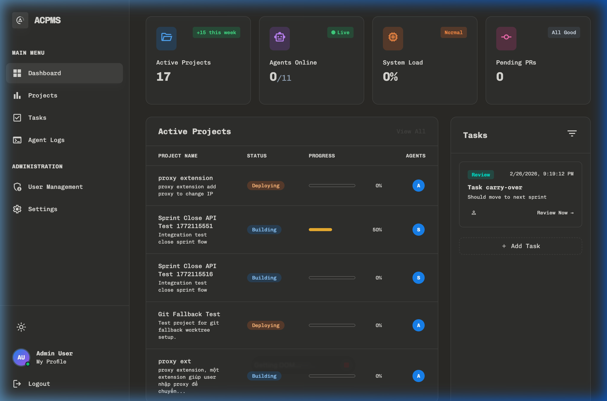
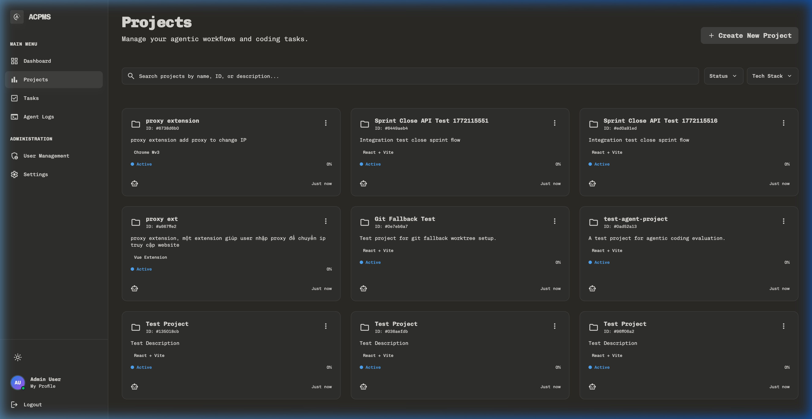
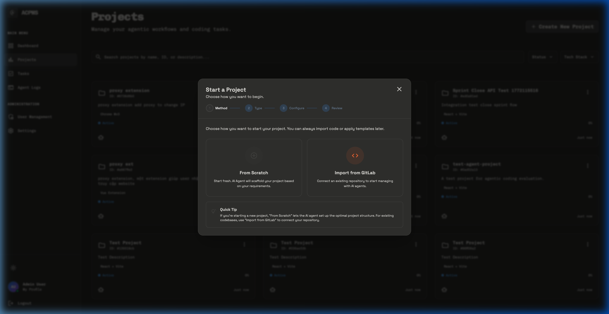
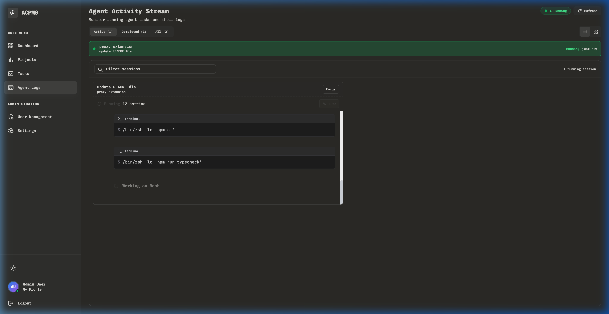
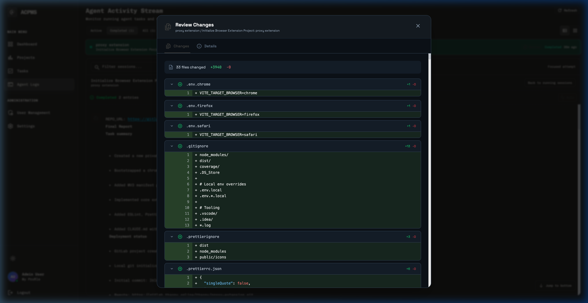
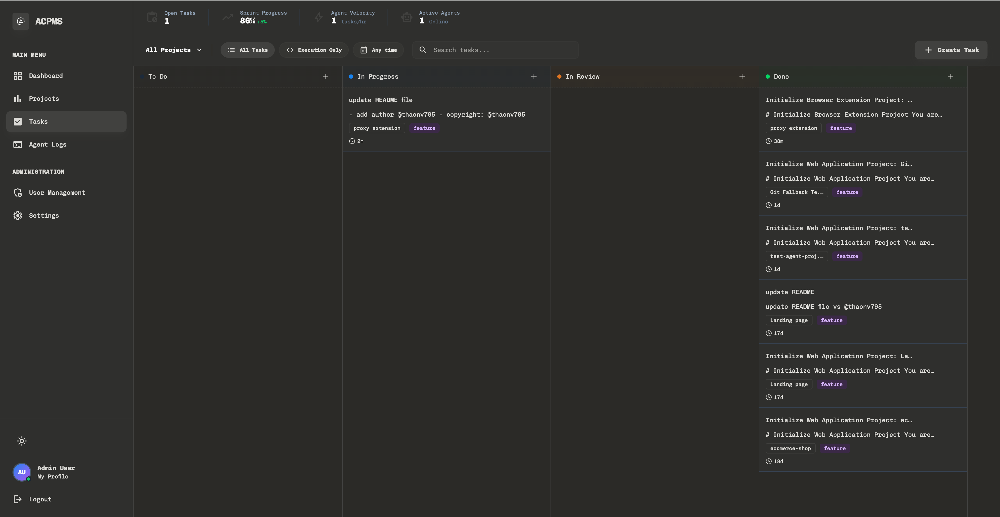
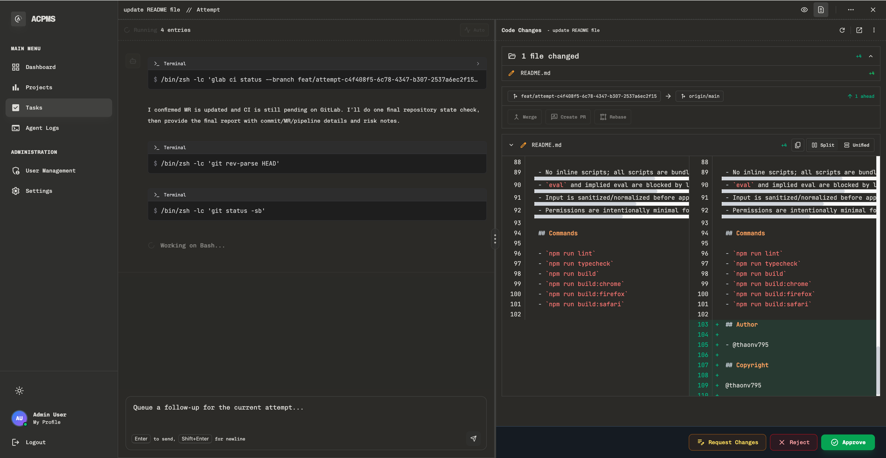
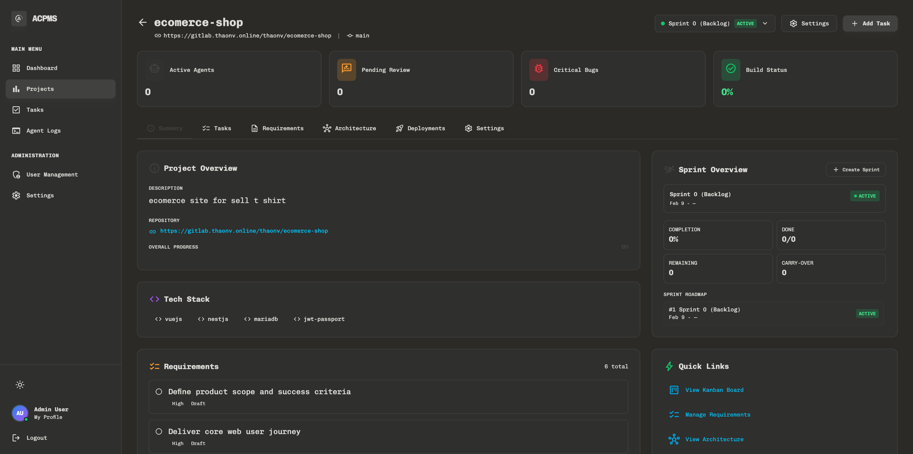
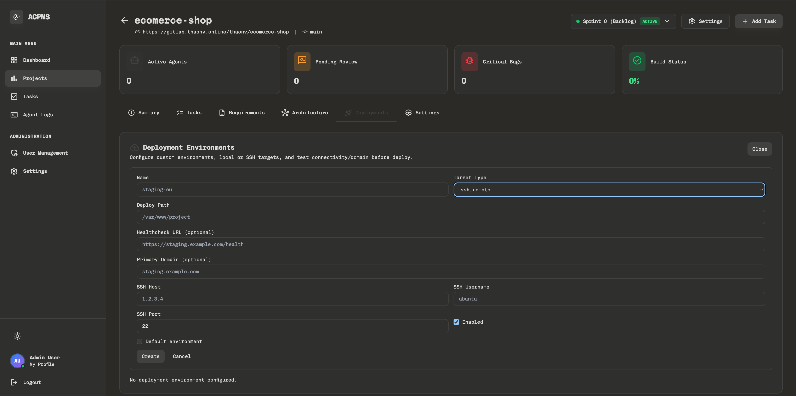
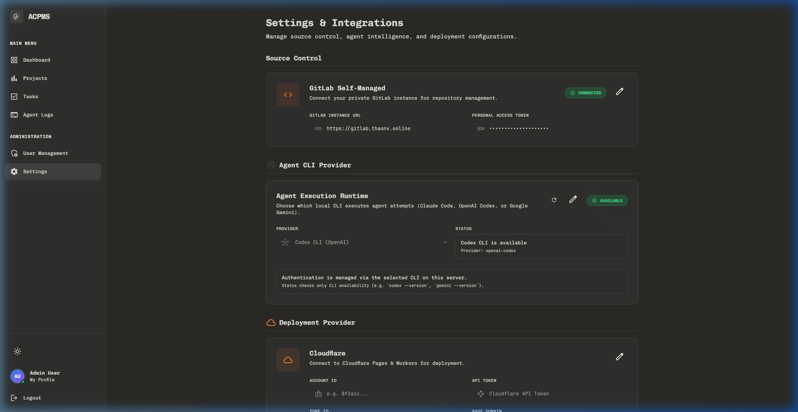

  <h1>ACPMS</h1>
  
<strong>Agentic Coding Project Management System</strong>

  <!-- Badges -->
  

    
    
    
    
    
  

  
   
  
  

---

## 🌟 Introduction

**ACPMS** (Agentic Coding Project Management System) is an advanced platform tailored to seamlessly manage projects, organize tasks, and integrate with AI agents to assist in software development and project tracking.

Our interface is built to be modern, intuitive, and extremely efficient, enabling teams and autonomous agents to collaborate effectively.

---

## 📸 Product Highlights

### Dashboard Overview
Gain immediate insights into your progress with our beautiful dashboard.

### Comprehensive Project Management
Easily manage all your project repositories and active endeavors.

### Create New Projects with Ease
A streamlined flow for initiating your next big idea.

### Project Settings
Configure projects with high granularity and flexibility.

### Attempt Timeline
Track project and agent progress via detailed timelines and logs.

### Code Diff Review
Seamlessly compare code changes right inside your management system.

---

## 🔥 Additional Showcase

Our intuitive UI adapts to your needs. Here are some extra views showcasing the refined UI aesthetics and layout control:

  
  
  

  
  
  

---

## ⚙️ App Settings

Customize your preferences and workspace parameters to fit your workflow perfectly.

---

## 📜 License

This project is licensed under the **MIT Open Source License**. See the [LICENSE](LICENSE) file for more information.

---

  
Built for the future of agentic engineering.

