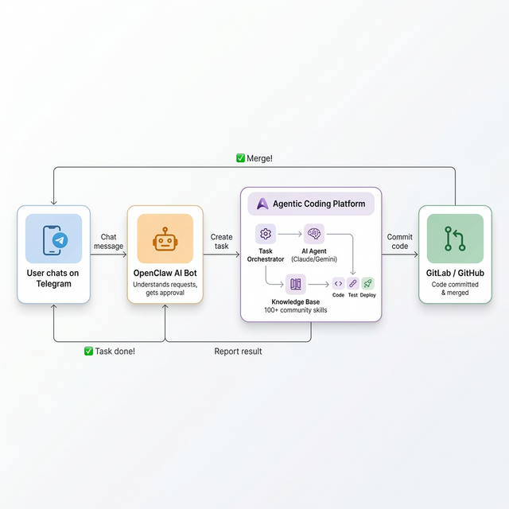
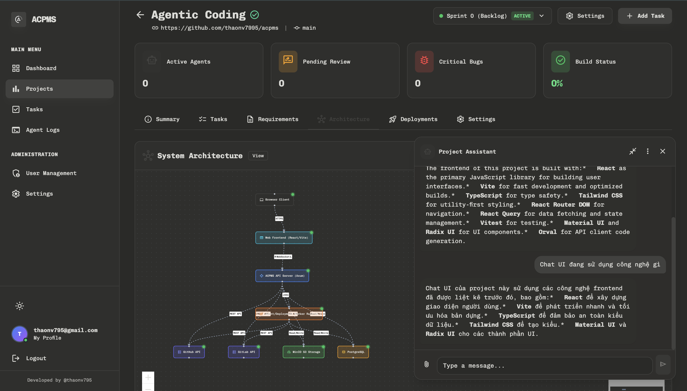
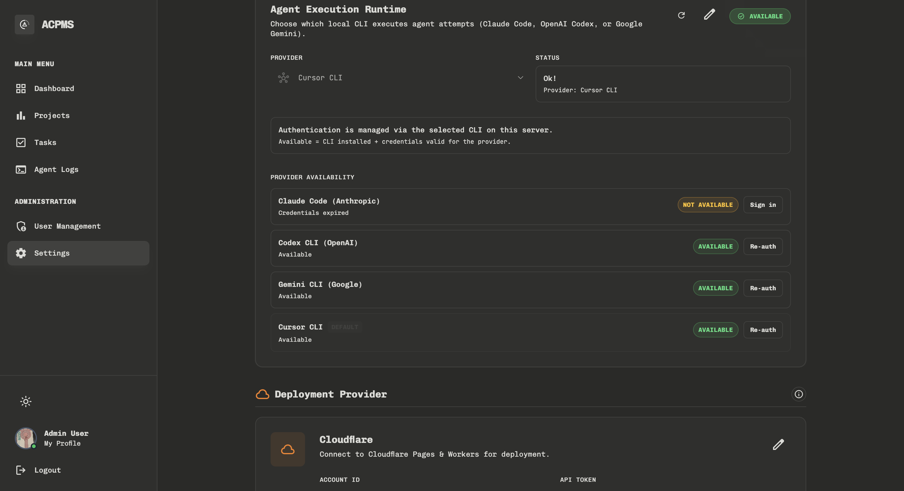
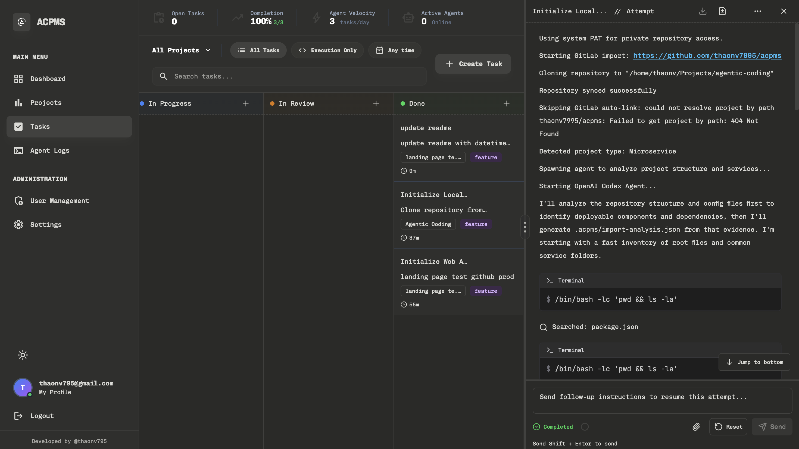

# ACPMS - Agentic Coding Project Management System



A platform that integrates Project Management (Requirements, Tasks, Bugs) with **AI Agents** (Claude Code / Codex / Gemini / Cursor AI) to automate the software development lifecycle. Inspired by **Vibe Kanban**, with a simpler, lightweight design.

Focused on **project management** and **breaking down requirements** into manageable pieces so projects stay under control. **BA, PO, PM, and Tester** can drive work from ticket to deployable preview—AI agents handle coding and deployment based on approved specs, with human-in-the-loop review. Preview environments let non-developers verify results before production. Best suited for **small teams and small projects**.

## Features

- **Contextual Awareness** – Agents work on Tasks linked to approved Requirements and Architecture
- **Full Lifecycle** – Plan → Code → Deploy → Fix with human-in-the-loop review
- **Multi-Agent Support** – Claude Code, OpenAI Codex, Gemini CLI, Cursor AI CLI (selectable in Settings)
- **GitLab Integration** – OAuth, MR creation, webhooks
- **Single Binary Distribution** – Backend serves frontend + S3 proxy for self-hosting

**Project & Assistant**



**Settings**



**Tasks**



## Requirements

- **Docker** – PostgreSQL 16 + MinIO (S3)
- **curl, jq, tar** – For installer script
- **Rust** (for development) – rustup
- **Node.js 20+** (for development) – Frontend build

## Quick Start (Install from Release)

**Prerequisites:** Docker + Docker Compose, curl, jq, tar.

The installer auto-starts Postgres + MinIO via Docker Compose if not running. It does **not** install Docker.

**Supported OS (installer + release binary):**

- Linux (`x86_64`/`amd64`, `arm64`/`aarch64`)
- macOS (`x86_64` Intel, `arm64` Apple Silicon)
- Windows via WSL2 (run `install.sh` inside a Linux distro such as Ubuntu/Debian)

**Option A – One-liner (recommended default for all supported OS):**

```bash
bash -c "$(curl -sSL https://raw.githubusercontent.com/thaonv7995/acpms/main/install.sh)"
```

Uninstall (one-liner mode):

```bash
bash -c "$(curl -fsSL https://raw.githubusercontent.com/thaonv7995/acpms/main/install.sh)" -- --uninstall
```

**Option B – Clone repo, then install** (alternative):

```bash
git clone https://github.com/thaonv7995/acpms.git
cd acpms
bash install.sh   # One-shot: auto-starts Postgres + MinIO, downloads binary, runs migration, creates admin
```

Uninstall (from cloned repo):

```bash
bash install.sh --uninstall
```

---

## Development

### Prerequisites

- Docker & Docker Compose
- Rust (rustup)
- Node.js 20+
- At least one Agent CLI (Claude Code / Codex / Gemini / Cursor AI) installed and authenticated

### Setup

```bash
git clone https://github.com/thaonv7995/acpms.git
cd acpms
make setup && make infra-up && make migrate && make dev
```

**Note:** Backend and frontend run locally (not in Docker) for agent CLI auth and worktrees. Use `DATABASE_URL` with `@localhost` in `.env` when running from host.

### Development Modes


| Command                     | Description                                                    |
| --------------------------- | -------------------------------------------------------------- |
| `make dev`                  | Backend + Vite dev server (HMR)                                |
| `./scripts/dev.sh --single` | Single binary mode – backend serves frontend (like production) |
| `./scripts/dev.sh --parity` | Production-parity backend runtime (release binary + restricted env) |


### Step-by-Step

1. **Clone & Setup**
  ```bash
   git clone https://github.com/thaonv7995/acpms.git
   cd acpms
   cp .env.example .env
   # Edit .env: DATABASE_URL with @localhost for local dev
  ```
2. **Start Infrastructure**
  ```bash
   docker compose up -d postgres minio
  ```
3. **Run Migrations**
  ```bash
   make migrate
  ```
4. **Start Dev Servers**
  ```bash
   make dev
   # Or: ./scripts/dev.sh           # Backend + Vite (HMR)
   # Or: ./scripts/dev.sh --single  # Single binary
   # Or: ./scripts/dev.sh --parity  # Production-parity runtime (recommended before deploy)
  ```
5. **Access**
  - Frontend: [http://localhost:5173](http://localhost:5173) (or [http://localhost:3000](http://localhost:3000) in single mode)
  - Backend API: [http://localhost:3000](http://localhost:3000)
  - PostgreSQL: localhost:5432

### Development First Login (Admin)

When you start development with `make dev` (or `./scripts/dev.sh` in any mode: default / `--single` / `--parity`), the script auto-ensures a local admin account:

- Email: `admin@acpms.local`
- Password: `acpms-dev-admin-123`

You can override this account:

```bash
ACPMS_DEV_ADMIN_EMAIL=you@example.com \
ACPMS_DEV_ADMIN_PASSWORD=your-strong-dev-password \
make dev
```

Disable auto-seed if needed:

```bash
ACPMS_DEV_SEED_ADMIN=0 make dev
```

### Agent CLI Authentication

Two ways to authenticate:

1. **Via UI (Settings)** – Go to **Settings → Agent CLI Provider**, select your provider, and follow the in-app auth flow (device code, OAuth, etc.).
2. **Via Terminal** – Install and authenticate the CLI locally, then select the provider in Settings:

```bash
# Claude Code CLI (2026): requires Node.js + npm, then:
npm install -g @anthropic-ai/claude-code
claude   # run once to configure API key
claude login && claude --version

# Codex
npm i -g @openai/codex
# export OPENAI_API_KEY=... (or login via UI)
codex --version

# Gemini CLI
# Run immediately (no install): npx @google/gemini-cli
# Install globally: npm install -g @google/gemini-cli
# macOS: brew install gemini-cli  or  sudo port install gemini-cli
gemini --version

# Cursor Agent CLI (agent command): install via official script, not via npm
curl https://cursor.com/install -fsS | bash
agent --version

# Optional: validate provider command resolution with production-like PATH
./scripts/provider-smoke.sh
```

---

## Project Structure

```
acpms/
├── crates/               # Rust workspace
│   ├── db/              # Database models & migrations
│   ├── server/          # Axum API server
│   ├── services/        # Business logic
│   ├── executors/       # Agent runtime
│   ├── gitlab/          # GitLab API client
│   ├── deployment/      # Deployment orchestration
│   ├── preview/         # Preview environment
│   └── utils/
├── frontend/            # React + TypeScript + Vite
├── .acpms/skills/       # Agent skills
├── docker-compose.yml   # Postgres + MinIO (backend runs outside)
├── install.sh           # One-liner installer
└── Makefile
```

---

## Configuration

Copy `.env.example` to `.env` and configure:


| Variable             | Description                                                       |
| -------------------- | ----------------------------------------------------------------- |
| `DATABASE_URL`       | PostgreSQL connection (use `@localhost` when running from host)   |
| `JWT_SECRET`         | Secret for JWT tokens                                             |
| `ENCRYPTION_KEY`     | Base64 32-byte key (`openssl rand -base64 32`)                    |
| `WORKTREES_PATH`     | Directory for agent-cloned repos (default: `./worktrees`)         |
| `S3_ENDPOINT`        | MinIO URL (default: `http://localhost:9000`)                      |
| `S3_PUBLIC_ENDPOINT` | Public URL for presigned URLs (e.g. `https://your-domain.com/s3`) |


**Configured in Settings UI (stored in DB):** GitLab (URL, OAuth, PAT), Cloudflare (tunnel), Agent API keys (OpenAI, Anthropic, Gemini, etc.). No need to set these in `.env`.

---

## Deployment

See **[DEPLOY.md](DEPLOY.md)** for production deployment.

```bash
make setup    # First-time .env
make deploy  # Build + migrate
./target/release/acpms-server  # Run backend
```

---

## Make Commands


| Command           | Description                            |
| ----------------- | -------------------------------------- |
| `make setup`      | Initial setup (.env, deps)             |
| `make dev`        | Start dev (infra + backend + frontend) |
| `make infra-up`   | Start PostgreSQL + MinIO               |
| `make infra-down` | Stop Docker                            |
| `make migrate`    | Run DB migrations                      |
| `make build`      | Build production                       |
| `make test`       | Run all tests                          |
| `make health`     | Health check                           |
| `make deploy`     | Build + migrate                        |
| `make clean`      | Remove build artifacts                 |


---

## Support

If ACPMS is useful to you, consider supporting its development:

[](https://buymeacoffee.com/thaonv795)

---

## Contributing

Contributions are welcome. Please open an [issue](https://github.com/thaonv7995/acpms/issues) or submit a pull request.

1. Fork the [repository](https://github.com/thaonv7995/acpms)
2. Create a feature branch (`git checkout -b feature/amazing`)
3. Commit changes (`git commit -m 'Add amazing feature'`)
4. Push to the branch (`git push origin feature/amazing`)
5. Open a Pull Request

For full guidelines (bug reports, PR process, code style), see [CONTRIBUTING.md](CONTRIBUTING.md).

---

## License

Apache License 2.0 – see [LICENSE](LICENSE)
