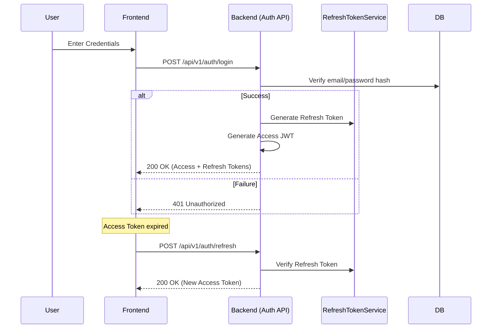

# Authentication & Identity Flow

This document describes the registration, login, and token management lifecycle.

## Flow Diagram

## Technical Components

### 1. Account Management
- **Routes**: `crates/server/src/routes/auth.rs`
- **Hashing**: Uses `bcrypt` via `acpms_services::hash_password`.
- **RBAC**: Users are assigned `SystemRole` (Viewer, User, Admin) upon registration.

### 2. JWT Security
- **Access Token**: Short-lived (30 minutes). Contains `sub` (user_id) and `jti` (token_id).
- **Refresh Token**: Long-lived, stored in the `refresh_tokens` database table. Tied to a specific Device/User-Agent.
- **Blacklisting**: `TokenBlacklistService` allows revoking specific access tokens before they expire (e.g., on logout).

### 3. Middleware Integration
- **Extractor**: `AuthUser` extractor verifies `Authorization: Bearer` cho các route có khai báo extractor này.
- **Permission Check**: `RbacChecker` is used in handlers to verify project-level or system-level permissions.
