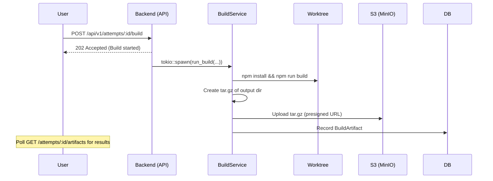
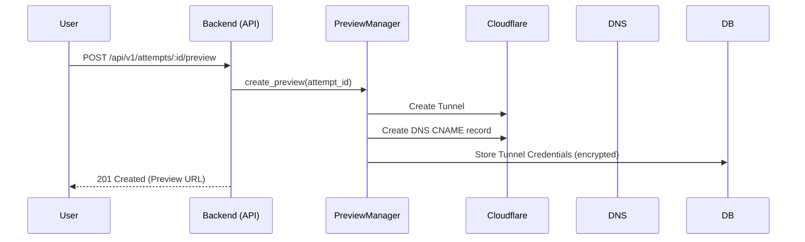
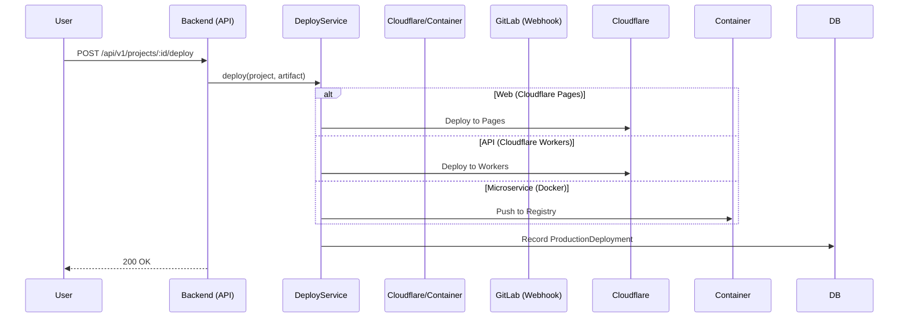

# Build, Preview & Production Deployment Flow

This document describes how the system handles building projects, creating ephemeral preview environments, and deploying to production.

> Status ordering note: deployment/preview metadata finalization now runs **before**
> an attempt is marked `success`. The server no longer relies on a post-success
> event listener for this pipeline.

## 1. Build & Artifact Flow

### Technical Details
- **Build Service**: `crates/services/src/build-service.rs`
- **Output Storage**: Artifacts are stored in S3/MinIO under `builds/{project_id}/{attempt_id}/artifacts.tar.gz`.
- **Auto-Detection**: The build command is auto-detected based on `ProjectType` (e.g., `npm run build` for Web, `cargo build --release` for API).

---

## 2. Ephemeral Preview Flow

### Technical Details
- **Preview Manager**: `crates/preview/src/manager.rs`
- **Networking**: Uses Cloudflare Tunnels (Argo) to expose internal processes without open ports.
- **Dynamic Subdomains**: Generates URLs like `https://task-{attempt_id}.yourdomain.com`.

---

## 3. Production Deployment Flow

### Technical Details
- **Deployment Service**: `crates/services/src/production-deploy-service.rs`
- **Auto-Deploy**: Can be triggered via GitLab Merge Webhook (`POST /api/v1/webhooks/gitlab/merge`).
- **Rollback**: Supported by superseding the active deployment record in the database.

---

## 4. Agent Structured Output Ingestion

Before an attempt is marked success, the executor parses structured fields from agent logs and persists them into `task_attempts.metadata`.

### Parsed Fields (from final report / skill outputs)
- `PREVIEW_TARGET` -> `preview_target`
- `PREVIEW_URL` -> `preview_url_agent`
- `deployment_status`
- `deployment_error`
- `deployment_kind`
- `production_deployment_status`
- `production_deployment_error`
- `production_deployment_url`
- `production_deployment_type`
- `production_deployment_id`
- `deploy_precheck`
- `deploy_precheck_reason`
- `smoke_status`
- `rollback_recommended`
- `delivery_status`

### Metadata Behavior
- Parsed values are stored under top-level keys where relevant.
- Full parsed deployment/report payload is also stored as `deployment_report`.
- This allows the pre-success deploy hook to detect agent-reported deploy outcomes and avoid duplicate backend deploy execution when appropriate.
