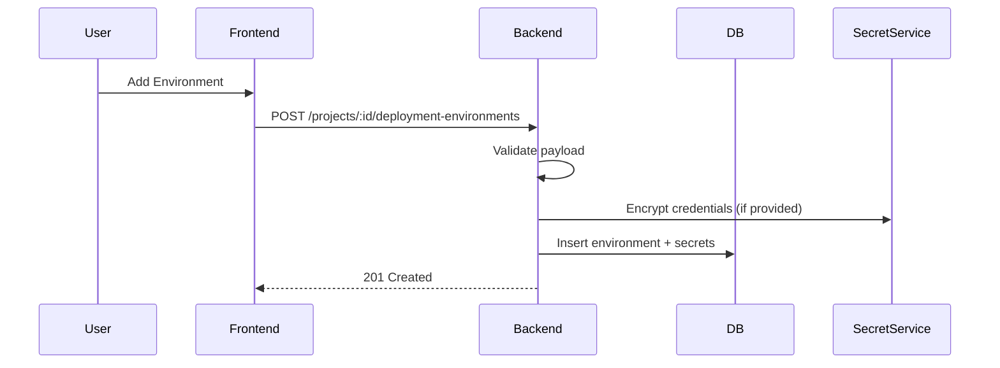
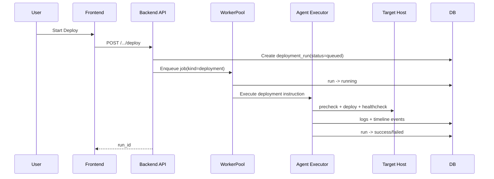
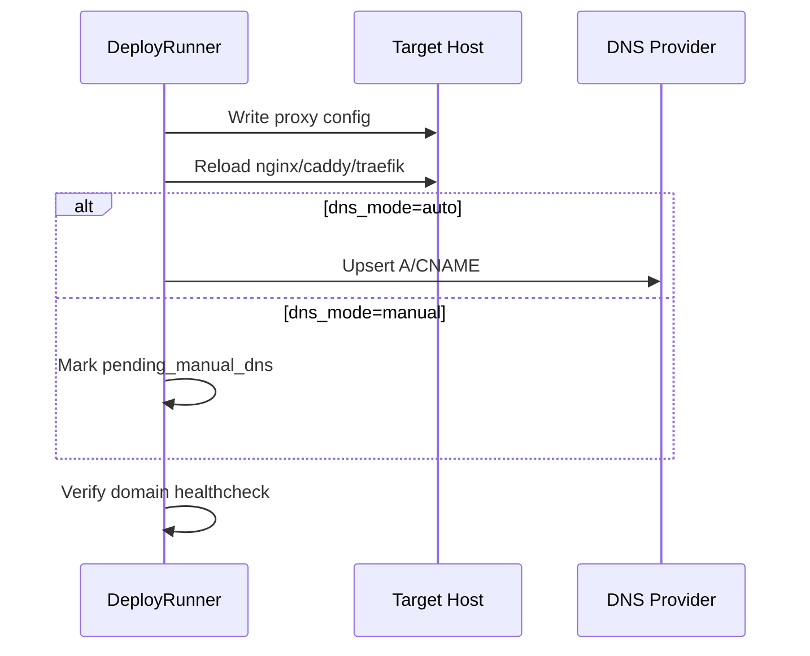
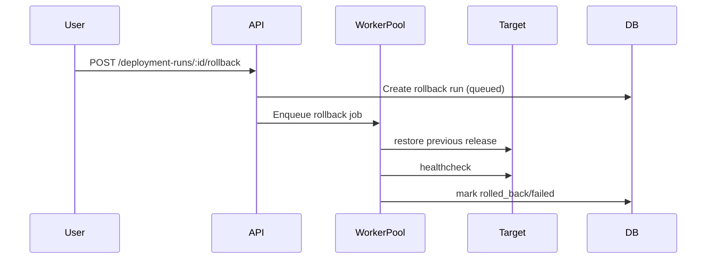

# Environment Deployment & Rollback Flow

Tài liệu kỹ thuật mô tả end-to-end flow cho deployment environments tùy biến theo project.

## 1. High-level Goals
- Environment names hoàn toàn tùy biến (`qa`, `uat`, `demo`, `staging-us`, ...).
- Trigger deploy từ UI tạo một deploy run có trạng thái + logs/timeline real-time.
- Hỗ trợ target `local` và `ssh_remote`.
- Hỗ trợ rollback như một run riêng.

## 2. Core Components
- **Deployment Environment Service**: CRUD + validation + secret handling.
- **Deployment Run Orchestrator**: queue/run/cancel/retry/rollback.
- **Target Runner**:
  - `LocalRunner`
  - `SshRunner`
- **Domain Mapping Service**: apply/reload proxy config.
- **Timeline/Log Writer**: append events và stream ra UI.

## 3. Create Environment Flow

### Validation checklist
- Name unique per project.
- Target type supported.
- SSH config đủ fields khi `ssh_remote`.
- Domain config hợp lệ (nếu bật domain mapping).

## 4. Start Deploy Flow

## 5. Deployment State Machine
- `queued`
- `running`
- `success`
- `failed`
- `cancelled`
- `rolling_back`
- `rolled_back`

Allowed transitions:
- `queued -> running|cancelled`
- `running -> success|failed|cancelled|rolling_back`
- `rolling_back -> rolled_back|failed`

## 6. Timeline Steps
Chuẩn step cho mọi target:
1. `precheck`
2. `connect`
3. `prepare`
4. `deploy`
5. `domain_config` (optional)
6. `healthcheck`
7. `finalize`

Mỗi step tạo timeline event với level `info|warning|error`.

## 7. Local Target Runner
Các thao tác mẫu:
- xác định deploy path
- extract artifact / git checkout source
- run deploy command template
- restart service
- healthcheck endpoint

## 8. SSH Remote Runner
Các thao tác mẫu:
- establish SSH session (known_hosts verified)
- upload artifact/manifest (nếu cần)
- execute remote script template
- reload proxy/service
- healthcheck từ backend

## 9. Domain Mapping Flow (Optional)

## 10. Rollback Flow

## 11. API Surface (Planned)
- `GET/POST /api/v1/projects/:id/deployment-environments`
- `GET/PUT/PATCH/DELETE /api/v1/projects/:id/deployment-environments/:env_id`
- `POST /api/v1/projects/:id/deployment-environments/:env_id/test-connection`
- `POST /api/v1/projects/:id/deployment-environments/:env_id/deploy`
- `GET /api/v1/projects/:id/deployment-runs`
- `GET /api/v1/deployment-runs/:run_id`
- `GET /api/v1/deployment-runs/:run_id/logs`
- `GET /api/v1/deployment-runs/:run_id/timeline`
- `POST /api/v1/deployment-runs/:run_id/cancel`
- `POST /api/v1/deployment-runs/:run_id/retry`
- `POST /api/v1/deployment-runs/:run_id/rollback`

## 12. Logging & Streaming
- Persist logs into deployment log store.
- Broadcast real-time logs via SSE/WS channel.
- UI run detail consume stream and render timeline giống Task Attempt panel.

## 13. Failure Handling
- Connection fail -> stop ngay tại `connect`.
- Deploy command fail -> mark failed + suggest rollback.
- Domain config fail -> mark partial failure (configurable hard/soft fail).
- Healthcheck fail -> auto rollback optional theo environment policy.

## 14. Security Guardrails
- Không log secret.
- SSH key/token encrypted at-rest.
- Deny-by-default command execution outside template policy.
- Full audit log for setup/deploy/rollback.
