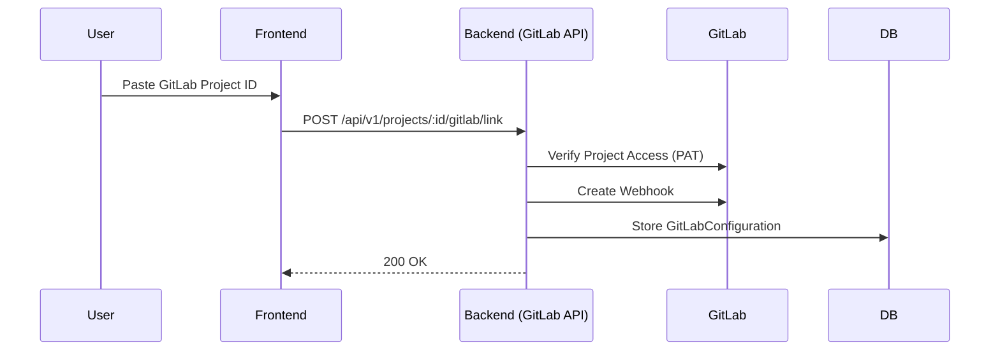
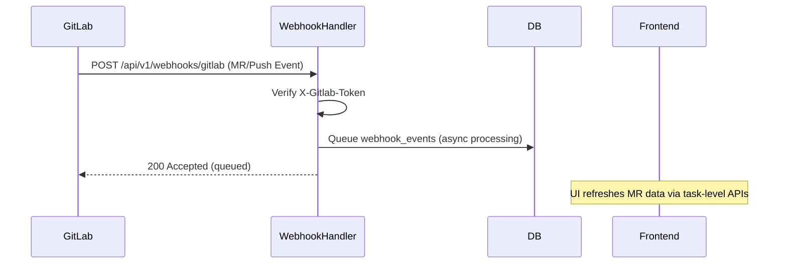

# GitLab Integration & Webhooks Flow

This document describes how the system interacts with GitLab for project linking, code review, and automated synchronization.

## 1. Project Linking Flow

### Technical Details
- **Service**: `crates/services/src/gitlab.rs`
- **Credentials**: Personal Access Tokens (PAT) can be global (system settings) or per-project.
- **Webhook Registration**: Automatically registers a webhook in GitLab for `push` and `merge_request` events.

---

## 2. Automated Code Review (MR Sync)

### Technical Details
- **Primary Handler**: `crates/server/src/routes/gitlab.rs::handle_webhook`.
- **Security**: Webhook payload được xác thực qua header `X-Gitlab-Token` đối chiếu `webhook_secret` theo project.
- **Persistence**: Event được queue vào webhook manager để xử lý bất đồng bộ.
- **Auto-Deploy on merge**: Luồng deploy riêng dùng `crates/server/src/routes/deployments.rs::handle_merge_webhook` tại endpoint `/api/v1/webhooks/gitlab/merge`.
