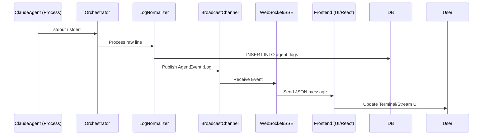

# Log Streaming & Real-time Monitoring Flow

This document describes how agent output is captured and streamed to the user's browser in real-time.

## Flow Diagram

## Technical Components

### 1. Output Capturing
- **File**: `crates/executors/src/orchestrator.rs`
- **Logic**: Uses `tokio::process::Child` to spawn the agent. It captures `stdout` and `stderr` handles.
- **Reading**: Specialized loops read lines from `BufReader` to ensure real-time response.

### 2. Normalization & Persistence
- **File**: `crates/server/src/services/log_normalizer.rs`
- **Actions**:
    - Redacts sensitive information (e.g., GitLab PATs).
    - Detects tool call patterns to generate structured metadata.
    - Saves the cleaned log line to the `agent_logs` table via `PgPool`.

### 3. Broadcasting
- **Channel**: Uses a `tokio::sync::broadcast` channel defined in `AppState`.
- **Event**: Publishes `AgentEvent::Log` containing the log content and metadata.

### 4. Real-time Delivery
- **WebSocket Route**: `crates/server/src/routes/websocket.rs`
    - Handler: `ws_handler`
    - Logic: Subscribes to the broadcast channel and sends messages that match the `attempt_id`.
- **SSE Route**: `crates/server/src/routes/streams.rs`
    - Handler: `stream_attempt_sse`
    - Logic: Provides a fallback streaming mechanism using Server-Sent Events and JSON Patch.

### 5. Frontend Consumption
- **Hook**: `frontend/src/hooks/useAgentLogs.ts` (or similar)
- **Component**: `frontend/src/components/task-detail-page/AgentLogsSection.tsx` (or similar)
- **Action**: Maintains a local state of logs and appends new incoming messages.
