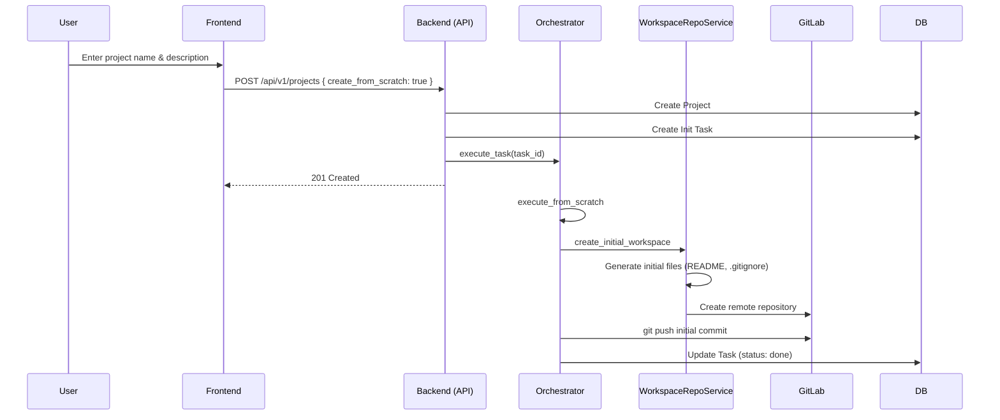

# "Create From Scratch" Flow

This document describes how the system initializes a new project from an empty state without an existing repository.

## Flow Diagram

## Technical Components

### 1. Frontend Entry
- **Component**: `frontend/src/pages/ProjectsPage.tsx`
- **Action**: Submits form with `create_from_scratch: true`.

### 2. Backend API
- **File**: `crates/server/src/routes/projects.rs`
- **Action**: Creates the database record and queues an `Init` task.

### 3. Workspace Initialization
- **Logic**: Handled in `crates/services/src/workspace_repos.rs`.
- **Generation**:
    - Creates basic project structure.
    - Generates a standard `README.md`.
    - Generates a relevant `.gitignore` based on desired project type.
- **Git Init**: Initializes a new git repository locally.

### 4. Remote VCS Integration
- **Platform**: Interaction with GitLab (or configured provider) via API.
- **Repository Creation**: Programmatically creates a NEW empty repository on the remote server.
- **Initial Push**: Adds the remote and pushes the first commit to establish the `main` branch.
