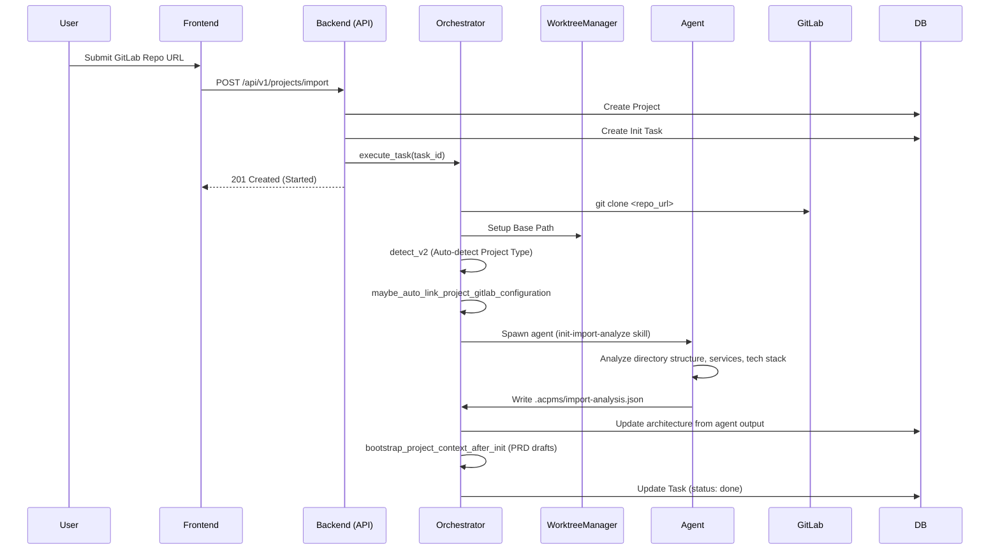

# Project Import & Initialization Flow

This document describes how an existing repository is imported into the system and how its project type is auto-detected.

## Flow Diagram

## Technical Components

### 1. Frontend Entry
- **Component**: `frontend/src/pages/ProjectsPage.tsx`
- **Action**: Opens the "Import Project" modal and submits the repository URL.

### 2. Backend Handler
- **File**: `crates/server/src/routes/projects.rs`
- **Function**: `import_project`
- **Actions**:
    - Validates the URL pattern.
    - Checks for duplicate repository and workspace path.
    - Creates a new `Project` record in the database.
    - Creates an `Init` task assigned to the project.
    - Spawns a background task to execute the `Init` task via the Orchestrator.

### 3. Cloning Process
- **Orchestrator**: Executes `git clone` using provided credentials (PAT for private repos).
- **Manager**: `WorktreeManager` allocates a persistent base directory for the repository in the server's storage.

### 4. Agent Analysis (init-import-analyze)
- **Skill**: `.acpms/skills/init-import-analyze/SKILL.md`
- **Flow**: After clone, spawns an agent (Claude/Codex/Gemini/Cursor) to:
  - Explore directory structure (src/, app/, packages/, services/)
  - Identify services and components (frontend, backend, database, auth, cache, queue, storage)
  - Evaluate current state (tech stack, build system, deployment config)
  - Write `.acpms/import-analysis.json` with architecture (nodes, edges) and assessment
- **Output**: Architecture config is parsed and persisted to `projects.architecture_config`
- **Fallback**: If agent fails or times out, heuristic-based architecture from `bootstrap_project_context_after_init` is used

### 5. Auto-Detection
- **Service**: `acpms_db::ProjectTypeDetector`
- **Logic**: Inspects files in the root directory (e.g., `package.json`, `Cargo.toml`, `requirements.txt`) to determine:
    - Language/Framework (e.g., Node.js, Rust, Python).
    - Build System (e.g., Vite, Cargo, Next.js).
- **Update**: The detected information is saved back to the `projects` table. User-selected type takes precedence when provided.
