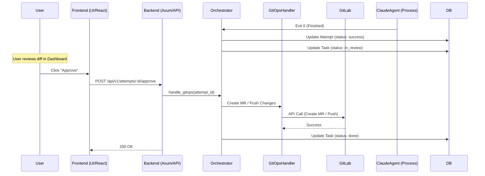

# Review & Approval Flow (GitOps Sync)

This document describes the workflow for reviewing agent changes and approving them for deployment/committing.

## Flow Diagram

## Technical Components

### 1. Completion Detection
- **Orchestrator**: Detects process exit. If successful, it updates the `task_attempts` status and triggers the `TaskService` to mark the task as `InReview`.
- **Worktree**: The temporary worktree is preserved to allow the user to view the diff.

### 2. Diff Review
- **Frontend Component**: `frontend/src/components/task-detail-page/DiffViewerModal.tsx`.
- **API**: Calls `GET /api/v1/attempts/:id/diff` to fetch the file changes.
- **Backend**: `crates/server/src/routes/task_attempts.rs:get_attempt_diff` computes the diff using `git diff` within the worktree.

### 3. Approval Action
- **Frontend**: Calls `approveAttempt(attemptId)` from `frontend/src/api/taskAttempts.ts`.
- **Backend Entry**: `crates/server/src/routes/task_attempts.rs:approve_attempt`.

### 4. GitOps Sync
- **Logic**: `orchestrator.rs` calls `handle_gitops`.
- **Interaction**: Interacts with the GitLab service to:
    - Push the local feature branch to the remote repository.
    - Create a Merge Request (MR) if configured.
- **Cleanup**: After successful sync, the local worktree is removed to save space.
