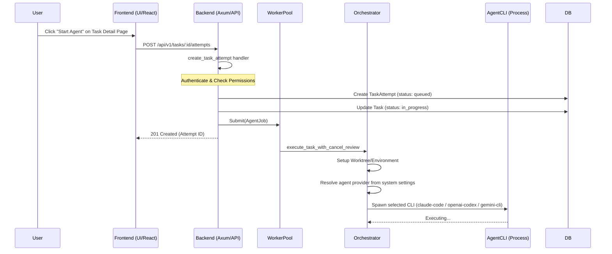

# Task Initiation & Agent Execution Flow

This document describes the end-to-end technical flow for starting an agent to work on a task.

## Flow Diagram

## Technical Components

### 1. Frontend Entry
- **File**: `frontend/src/pages/TaskDetailPage.tsx`
- **Action**: `handleStartAgent` calls `createTaskAttempt(taskId)` from `frontend/src/api/taskAttempts.ts`.

### 2. Backend API Endpoint
- **File**: `crates/server/src/routes/task_attempts.rs`
- **Function**: `create_task_attempt`
- **Logic**:
    - **Authentication**: `auth_user: AuthUser` extractor verifies JWT.
    - **Authorization**: `RbacChecker::check_permission` verifies `Permission::ExecuteTask`.
    - **Persistence**: `TaskAttemptService` creates a record in the `task_attempts` table.
    - **Task Update**: `TaskService` set task status to `InProgress`.

### 3. Job Submission
- **Worker Pool**: The job is submitted to `state.worker_pool.submit(job)`.
- **Job Definition**: `AgentJob` includes attempt ID, task ID, repo path, and project settings (timeout, retry).

### 4. Orchestration
- **File**: `crates/executors/src/orchestrator.rs`
- **Method**: `execute_task_with_cancel_review`
- **Environment**: Sets up a temporary worktree using `WorktreeManager`.
- **Execution**: Spawns the selected agent CLI process (provider chosen in Settings) and redirects its pipes for log capturing.
