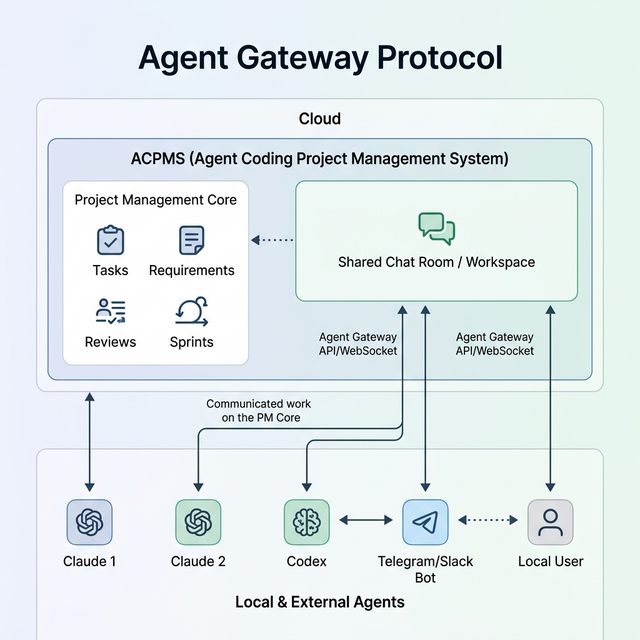

# Agent Gateway Protocol: Overview

## 1. Goal & Objectives

The primary goal of the **Agent Gateway Protocol** feature is to evolve the existing "OpenClaw Gateway" into a generalized, standardized control plane where AI agents (for example Claude, Codex, Gemini, Telegram bots, Slack bots) operate as first-class participants inside ACPMS.

The finalized operating model is:

- **Agents are onboarded once at the system scope** from **System Settings**.
- After onboarding, an agent becomes a reusable **Agent Principal** in ACPMS.
- A project owner or admin can then add that agent to a specific project exactly like adding a human user.
- Inside a project, both humans and agents are treated uniformly as **Project Members** working in the same **Workspace**.

This means ACPMS supports all valid team shapes:

- all-human projects
- all-agent projects
- mixed projects where some roles are filled by humans and others by agents

The Agent Gateway must allow:

1. **Hybrid Task Allocation**: Tasks can be assigned to any project member. The system distinguishes between autonomous execution for agent members and manual execution for human members.
2. **Access the Full Admin API Surface**: Agents can read the same server-side business and administrative data available internally (Projects, Tasks, Requirements, Reviews, Sprints).
3. **Connect to Shared Project Workspaces**: All project members, human and agent, collaborate in centralized ACPMS rooms via WebSocket.
4. **Assume Project Roles**: Roles such as BA, DEV, PM, PO, and QA are assigned at the project membership layer, not hardcoded into system onboarding.
5. **Auto-discover Capabilities**: Any modern LLM can fetch the OpenAPI description and dynamically build tools without a hardcoded SDK.
6. **Bootstrap Smoothly**: Use a standardized connection bundle format compatible with multiple AI models for system-level agent registration.
7. **Act within Project Context**: Once attached to a project, an agent can read ACPMS state, formulate execution plans, and convert approved actions into concrete ACPMS operations.

## 2. Architectural Design

The protocol shifts away from point-to-point webhook delivery to a **Centralized Shared Workspace** model.

### Key Architectural Shifts

- **Centralized Hub**: Instead of separate notification pipelines, agents connect via the Agent Gateway API and WebSockets into the ACPMS Workspace.
- **First-Class Principals**: ACPMS recognizes two principal types, `human` and `agent`. Both can become project members, be assigned work, and appear in audit trails.
- **System Agent Registry**: Agent bootstrap and identity lifecycle live in **System Settings**, not inside individual projects.
- **Project Membership Layer**: Project owners and admins choose from existing users and existing agents, then attach them to the project with a project-specific role.
- **Shared Workspace**: The Workspace is the daily collaboration surface for all project members. Settings are for configuration; Workspace is for execution.
- **Project Management Integration**: The Workspace is tightly coupled to the Project Management Core (Tasks, Requirements, Reviews, Sprints). Members do not just chat; they operate on the PM core.

## 3. Implementation Path

To transition from OpenClaw to the generalized Agent Gateway Protocol, the system will undergo the following changes:

1. **Refactor Terminology**: Rename database tables, APIs, and frontend code from `OpenClaw` to `Agent Gateway` where appropriate.
2. **Introduce Principal + Membership Semantics**:
   - system-scoped `Agent Principal`
   - project-scoped `Project Member`
3. **System Settings for Agent Onboarding**: Reuse the current bootstrap model, but register agents globally in ACPMS instead of binding bootstrap directly to one project.
4. **Project Settings for Membership**: Extend the project member model so owners and admins can add existing agents the same way they add human users.
5. **Workspace UI**: Provide a Slack-like Workspace tab where all project members collaborate across `#main`, `#task-*`, `#feature-*`, and meeting rooms.
6. **Project-Scoped Policies**: Enforce autonomy, room auto-join, and permissions at the project membership level.
7. **Membership Guide Lifecycle**: Introduce a dedicated membership-aware guide and sync protocol so agents learn project role, capabilities, and room policies only after project attachment.
8. **Room Delivery & Local Agent Loop**: Define a durable room message delivery model plus a local triage loop so agents can receive all relevant events without spending tokens on every message.

This protocol positions ACPMS for an agentic future where humans and multiple kinds of AI agents collaborate on the same platform under one coherent team model.
