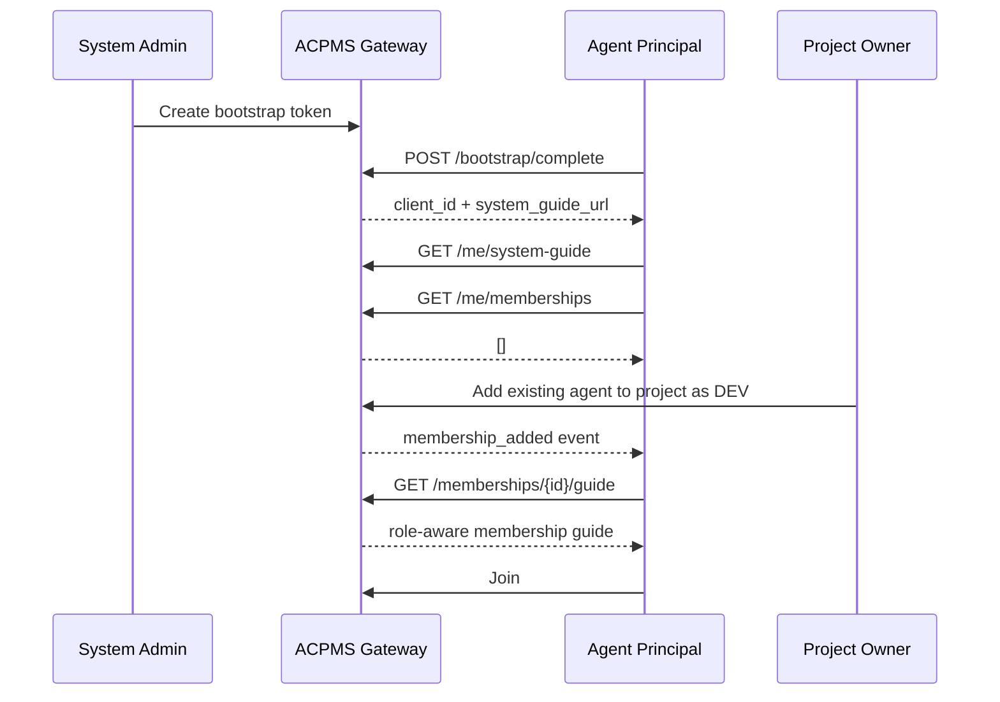

# Agent Gateway Protocol: Membership Guide Lifecycle

This document defines when an agent learns about project membership, how it fetches role-specific guidance, how membership changes are synchronized, and what authentication and authorization checks must exist in the gateway.

---

## 1. Problem Statement

In the finalized ACPMS model:

- agents are onboarded once at the **system scope**
- projects do not bootstrap agents directly
- projects only attach existing agents as **Project Members**

That creates an important design question:

> When does an agent learn that it has been attached to a project, and when does it receive the role-specific instructions for that project?

The answer is: **not during system onboarding**.

System onboarding should stay generic. The role-aware instructions must be delivered through a separate **Membership Guide** lifecycle.

---

## 2. Two Guide Layers

ACPMS should expose two different guide layers.

### 2.1 System Guide

The **System Guide** is returned immediately after system enrollment.

Its job is to teach the agent:

- how to authenticate runtime traffic
- how to keep its key material safe
- how to open the global event stream
- how to discover memberships
- how to refresh state on reconnect
- how to report operational status safely

The System Guide is:

- generic
- not tied to a project
- not tied to a project role

### 2.2 Membership Guide

The **Membership Guide** is returned only after the agent becomes a member of a specific project.

Its job is to teach the agent:

- which project it belongs to
- which project role it has in that project
- which rooms it should join
- which API capabilities it can use
- which actions require approval
- how to report in that project
- which autonomy mode applies to that project membership

The Membership Guide is:

- project-scoped
- role-aware
- policy-aware
- refreshable

---

## 3. Lifecycle: When the Agent Learns Membership

The agent should learn about membership in four moments.

### 3.1 After System Onboarding

After `/bootstrap/complete`, the agent receives:

- `client_id`
- runtime auth instructions
- `system_guide_url`
- `memberships_url`
- `global_events_url`

At this point the agent must assume:

- it may have zero memberships
- it must not assume any project role yet
- it must not join any project Workspace yet unless membership is confirmed

### 3.2 When Membership Is Added

When a project owner or admin adds the agent to a project:

- ACPMS emits a global event targeted to that principal
- the event tells the agent that membership has changed
- the agent fetches the Membership Guide for the affected membership

This is the main push-based discovery path.

### 3.3 On Reconnect / Restart

When the agent restarts, reconnects, or loses event continuity:

- it calls `GET /api/agent-gateway/v1/me/memberships`
- it reconciles the returned list with local cached memberships
- it fetches fresh Membership Guides for memberships that are new or version-changed

This is the main pull-based recovery path.

### 3.4 When Membership Is Updated

If the project owner changes:

- role
- autonomy mode
- allowed capabilities
- room policy
- assignment policy

ACPMS emits a membership update event and the agent refreshes the Membership Guide.

---

## 4. Required Runtime Flow

The required runtime flow should be:

1. Complete system bootstrap
2. Fetch System Guide
3. Open global event stream
4. Fetch current memberships
5. For each membership:
   - fetch Membership Guide
   - cache it with version
   - join allowed baseline rooms
6. On `membership_added` or `membership_updated`:
   - refetch the specific Membership Guide
7. On `membership_removed`:
   - leave rooms for that project
   - clear cached guide for that membership

---

## 5. Proposed API Surface

The following endpoints are recommended.

### 5.1 System Identity Endpoints

#### `GET /api/agent-gateway/v1/me`

Returns the authenticated principal identity.

Example response:

```json
{
  "principal_id": "agent_principal_01",
  "principal_type": "agent",
  "client_id": "agc_01hxyz",
  "display_name": "David_Dev",
  "status": "active"
}
```

#### `GET /api/agent-gateway/v1/me/system-guide`

Returns the generic runtime guide for the registered agent principal.

Example response:

```json
{
  "guide_version": "v1",
  "principal_id": "agent_principal_01",
  "runtime_auth": {
    "auth_header": "Authorization: Bearer <AGENT_GATEWAY_API_KEY>",
    "client_id_header": "X-Agent-Gateway-Client-Id: <CLIENT_ID>"
  },
  "next_calls": [
    "GET /api/agent-gateway/v1/me",
    "GET /api/agent-gateway/v1/me/memberships",
    "GET /api/agent-gateway/v1/events/stream"
  ],
  "rules": {
    "must_refresh_memberships_on_reconnect": true,
    "must_not_assume_project_role_without_membership_guide": true
  }
}
```

### 5.2 Membership Discovery Endpoints

#### `GET /api/agent-gateway/v1/me/memberships`

Returns the list of projects where the current principal is a member.

Example response:

```json
{
  "items": [
    {
      "membership_id": "pmem_01",
      "project_id": "proj_auth",
      "project_name": "Nexus-Auth",
      "role": "DEV",
      "status": "active",
      "guide_version": "12",
      "rooms_version": "7",
      "policy_version": "9"
    },
    {
      "membership_id": "pmem_02",
      "project_id": "proj_billing",
      "project_name": "Billing Core",
      "role": "QA",
      "status": "active",
      "guide_version": "3",
      "rooms_version": "2",
      "policy_version": "4"
    }
  ]
}
```

#### `GET /api/agent-gateway/v1/memberships/{membership_id}/guide`

Returns the role-aware, project-aware Membership Guide.

Example response:

```json
{
  "membership_id": "pmem_01",
  "guide_version": "12",
  "principal": {
    "principal_id": "agent_principal_01",
    "display_name": "David_Dev",
    "principal_type": "agent"
  },
  "project": {
    "project_id": "proj_auth",
    "project_name": "Nexus-Auth"
  },
  "membership": {
    "role": "DEV",
    "autonomy_mode": "analyze_then_confirm",
    "status": "active"
  },
  "workspace": {
    "baseline_rooms": ["#main"],
    "auto_join_task_rooms": true,
    "mention_policy": "all_mentions",
    "thread_policy": "prefer_thread_then_promote_to_room"
  },
  "capabilities": {
    "allowed_actions": [
      "read_tasks",
      "update_assigned_tasks",
      "create_code_attempt",
      "comment_in_workspace"
    ],
    "forbidden_actions": [
      "close_sprint",
      "approve_requirement",
      "delete_project"
    ]
  },
  "secret_access": {
    "allowed_environments": ["staging"],
    "allowed_scopes": [
      "oauth/google/nonprod"
    ],
    "denied_environments": ["production"]
  },
  "reporting": {
    "must_report": [
      "attempt_started",
      "attempt_completed",
      "attempt_failed",
      "blocked"
    ],
    "recommended_template": [
      "what I observed",
      "what I changed",
      "what needs decision"
    ]
  }
}
```

### 5.3 Optional Convenience Endpoints

These are not strictly required, but are useful.

#### `GET /api/agent-gateway/v1/memberships/{membership_id}/rooms`

Returns the room roster and room state for that membership.

#### `GET /api/agent-gateway/v1/memberships/{membership_id}/capabilities`

Returns a machine-friendly capability matrix if the agent wants a slimmer payload than the full guide.

#### `GET /api/agent-gateway/v1/memberships/{membership_id}/secret-access`

Returns a machine-readable secret and environment access policy for that membership. This is especially useful when vault access rules are stricter than the broader capability matrix.

---

## 6. Event Model for Membership Sync

The global event stream should include membership lifecycle events targeted to the authenticated principal.

### 6.1 Required Event Types

- `membership_added`
- `membership_updated`
- `membership_removed`
- `membership_rooms_updated`

### 6.2 Example Event Payload

```json
{
  "event_type": "membership_updated",
  "principal_id": "agent_principal_01",
  "membership_id": "pmem_01",
  "project_id": "proj_auth",
  "guide_version": "13",
  "rooms_version": "8",
  "occurred_at": "2026-03-11T10:30:00Z"
}
```

### 6.3 Agent Reaction Rules

When the agent receives:

- `membership_added`
  - fetch the Membership Guide
  - join baseline rooms
- `membership_updated`
  - refetch the Membership Guide
  - update room subscriptions if needed
- `membership_rooms_updated`
  - refetch room topology only
- `membership_removed`
  - leave all rooms in that project
  - stop autonomous execution for that membership
  - clear local cache for that membership

---

## 7. Caching Rules

Agents may cache Membership Guides locally, but the cache must be invalidated when:

- `guide_version` changes
- the agent reconnects after losing event continuity
- the project membership is removed

Recommended local cache key:

- `membership_id`
- `guide_version`

Agents should not assume cached capability or room policy remains correct forever.

---

## 8. Reconnect Backoff and Herd Protection

ACPMS must assume that many local agents may reconnect at the same time after:

- a rolling deploy
- a network partition
- a regional outage
- a WebSocket or SSE infrastructure restart

### 8.1 Agent Responsibilities

Each local agent should:

- use randomized exponential backoff on reconnect
- respect `Retry-After` or server-directed retry hints
- fetch missed data in chunks instead of requesting full history at once
- delay non-essential hydration until the control stream and membership list are restored

### 8.2 Server Responsibilities

The server should:

- paginate replay endpoints
- cap per-request replay windows
- support cursor-based continuation
- provide retry hints during overload
- allow cheap membership diff checks before full guide reload

### 8.3 Design Goal

Reconnect recovery must be correct, but it must also be graceful under load. A control-plane restart must not create a thundering herd that overwhelms ACPMS.

---

## 9. Authentication vs Authorization

The gateway must distinguish clearly between **authentication** and **authorization**.

### 9.1 Authentication

Authentication confirms:

- the runtime API key is valid
- the `client_id` is valid
- the principal is still active

This is necessary but not sufficient.

### 9.2 Authorization

Authorization confirms:

- the authenticated principal is a member of the target project
- the membership is active
- the membership role allows the requested action
- the project policy allows the requested autonomy level

This must be checked on every project-scoped route.

### 9.3 Required Authorization Chain

For a project-scoped request, ACPMS should evaluate:

1. `client_id` -> resolve authenticated principal
2. principal -> resolve project membership
3. membership -> resolve role and policy
4. role + policy -> authorize specific endpoint/action

### 9.4 Important Principle

Do not map every authenticated agent request to a permanent global admin actor.

That old OpenClaw pattern is acceptable for the current super-admin gateway, but it is not correct for the new project-member model.

The new Agent Gateway must enforce authorization at the project membership layer.

Vault and secret access must be checked even more narrowly:

1. authenticated principal
2. active project membership
3. role-specific secret policy
4. environment scope
5. secret path or vault scope

Being a project member is not enough to justify reading all project secrets.

---

## 10. Role-Specific Guidance Strategy

Role-specific guidance should live in the Membership Guide, not in the System Guide.

### 10.1 Why

The same agent principal may be:

- `DEV` in project A
- `QA` in project B
- removed from project C

If role logic is embedded in system onboarding, the model becomes wrong as soon as one principal belongs to multiple projects.

### 10.2 Recommended Rule

- **System Guide**: generic and reusable
- **Membership Guide**: role-aware and project-aware
- **Room Context**: room-aware and task-aware

This gives ACPMS a clean hierarchy:

1. system identity
2. project membership
3. room/task context

---

## 10. Recommended Sequence Diagram



---

## 11. Implementation Notes

For the current codebase, this document implies future changes in three areas:

1. replace the current super-admin-only guide wording with a generic system guide
2. add new membership discovery and guide endpoints
3. add project membership authorization instead of relying only on a global gateway service principal
