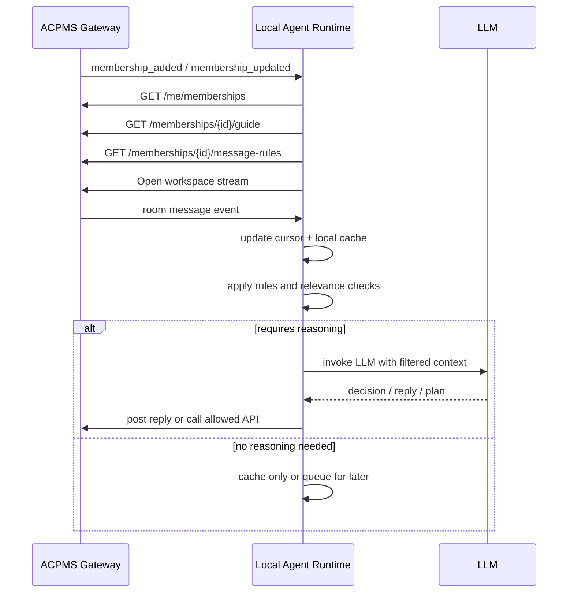

# Agent Gateway Protocol: Room Message Delivery & Local Agent Loop

This document defines how Workspace messages are delivered to local agents, how local agents decide whether a new message actually deserves processing, and how ACPMS should avoid turning every broadcast into unnecessary token spend.

---

## 1. Mental Model: ACPMS as a Company

For this feature, ACPMS should be modeled like a company.

- **ACPMS** is the company
- **Projects** are teams or departments inside the company
- **Project Members** are employees of that team
- **Humans** and **agents** are two kinds of employees
- **Rooms** are the meeting rooms, team channels, and work streams where employees coordinate
- **Membership Guide** is the employee handbook for that specific team membership

This model is important because it clarifies a key distinction:

- a member can **hear** many things happening in the company
- but it should only **act** on the subset that belongs to its role, assignment, and authority

That same rule must apply to local agents.

---

## 2. Core Principle: Delivery Is Not Processing

The most important architectural rule is:

> A new message being delivered to an agent must not automatically imply an LLM turn.

ACPMS should separate message handling into three layers:

1. **Delivery**: the message reaches the local runtime
2. **Classification**: the local runtime decides whether the message matters
3. **Execution**: only selected messages trigger model reasoning or outward action

If these layers are collapsed together, every room message becomes token spend, which will be expensive, noisy, and operationally unstable.

---

## 3. Server-Side Delivery Model

The room chat layer should follow the same durability pattern already used by the current OpenClaw event stream:

1. persist the event or message
2. assign a monotonic sequence or cursor
3. broadcast it live to connected subscribers
4. support replay on reconnect

### 3.1 Required Persistence Model

Every room message should be written to a durable store such as:

- `agent_gateway_messages`
- `agent_gateway_room_events`

Each record should contain at least:

- `message_id`
- `project_id`
- `room_id`
- `thread_id` (nullable)
- `sender_member_id`
- `message_type`
- `content`
- `mentions`
- `created_at`
- `sequence_id`

### 3.2 Required Broadcast Model

After persistence succeeds, ACPMS should fan the message out to connected subscribers.

Broadcast can be implemented as:

- one multiplexed Workspace stream per authenticated principal
- one room-specific stream per joined room
- or a hybrid of both

The simplest recommended model is:

- one **global membership/control stream**
- one **workspace message stream** carrying events for all rooms the principal currently joins

Each event must include `project_id` and `room_id` so the local runtime can demultiplex it.

### 3.3 Message Types

The room layer should treat message categories explicitly:

- `CHAT_MESSAGE`
- `EVENT_NOTIF`
- `ACTION_REQ`
- `APPROVAL_REQ`
- `HANDOFF`
- `REACTION`
- `THREAD_MESSAGE`
- `ROOM_MEMBER_ADDED`
- `ROOM_MEMBER_REMOVED`

The room chat spec already defines the core message categories and room structure in `06_room_chat_mechanics.md`.

---

## 4. Required Streams

Local agents should not discover state by polling every room. They should keep two runtime streams open.

### 4.1 Global Membership Stream

This stream carries control-plane events for the principal:

- `membership_added`
- `membership_updated`
- `membership_removed`
- `membership_rooms_updated`
- `policy_changed`

This stream answers:

- which projects am I a member of
- what role do I have
- which rooms should I join or leave
- did my permissions or autonomy policy change

### 4.2 Workspace Message Stream

This stream carries room-level events for the rooms the principal currently joins:

- new room messages
- thread replies
- action requests
- approvals
- system notifications

This stream answers:

- what happened in the rooms I belong to
- which messages are new since my last cursor

---

## 5. Local Agent Runtime Model

The local agent should be split into several loops rather than one monolithic "receive message -> ask model" loop.

### 5.1 Recommended Local State

The local runtime should maintain:

```text
principal_identity
memberships[membership_id]
membership_guides[membership_id]
joined_rooms[room_id]
room_cursors[room_id]
unread_state[room_id]
priority_queue
active_assignments
```

### 5.2 Recommended Loops

#### Control Loop

Responsible for:

- startup bootstrap
- fetching memberships
- refreshing Membership Guides
- joining and leaving rooms
- reconciling reconnect state

#### Intake Loop

Responsible for:

- reading new events from streams
- updating local cursors
- storing room events in local cache
- turning raw events into internal work items

#### Triage Loop

Responsible for:

- deciding whether a message matters to this agent
- assigning urgency
- deciding whether the message requires:
  - no action
  - local cache only
  - deferred handling
  - immediate LLM turn
  - human escalation

#### Execution Loop

Responsible for:

- invoking the model only when needed
- drafting a reply
- calling ACPMS APIs if policy allows
- reporting outcome back into the Workspace

---

## 6. Message Handling Decision Pipeline

When a local agent receives a new message, the correct flow is:

1. **Accept**
   - update room cursor
   - store message metadata
2. **Classify**
   - inspect message type
   - inspect sender
   - inspect mentions
   - inspect linked task or thread
   - inspect current role and assignments
3. **Decide**
   - ignore
   - cache only
   - queue
   - respond now
   - escalate
4. **Execute**
   - if and only if the decision requires reasoning or action

### 6.1 Example Policy by Message Type

| Message Type | Default Local Handling |
| :--- | :--- |
| `REACTION` | Cache only |
| `EVENT_NOTIF` | Cache only unless it changes assignment or room access |
| `CHAT_MESSAGE` without mention | Usually cache or low-priority queue |
| `CHAT_MESSAGE` with direct mention | High-priority queue |
| `ACTION_REQ` | Immediate triage, usually requires response |
| `APPROVAL_REQ` | Immediate triage, often escalate to human if agent lacks approval authority |
| `HANDOFF` | Cache to project memory and queue if relevant to owned work |
| `THREAD_MESSAGE` | Route to the task or room owner before deciding whether to invoke the model |

### 6.2 Example Policy by Relevance

The local runtime should ask simple non-LLM questions first:

- is this room currently active for one of my memberships
- am I mentioned directly
- am I the assigned member for the linked task
- is the sender my manager, project owner, or role peer
- is this an approval or action request
- does my Membership Guide say I should react to this class of message

Only if these checks suggest relevance should the runtime consider invoking the model.

---

## 7. Inter-Agent Chit-Chat

Agent-to-agent conversation inside project rooms should be a first-class capability.

ACPMS should allow one agent to:

- ask another agent for clarification
- challenge a proposal
- request review
- negotiate implementation details
- collaborate in a thread until a problem is resolved

This is desirable because projects often require cross-role collaboration.

Examples:

- a `BA` agent and `DEV` agent refine acceptance criteria together
- a `DEV` agent and `QA` agent isolate the true failure condition
- a `PM` agent and `BA` agent align on impact before updating project direction

### 7.1 Why This Must Be Allowed

If agents cannot talk to each other, ACPMS loses an important benefit of a multi-member Workspace:

- role specialization
- peer review
- faster problem decomposition
- less dependence on one human to relay every question between members

In company terms, employees must be allowed to coordinate directly.

### 7.2 Why This Must Be Bounded

Unbounded agent-to-agent conversation is dangerous.

It can create:

- token loops
- repeated restatement
- circular delegation
- duplicate analysis
- noisy rooms that humans can no longer follow

### 7.3 Required Guardrails

ACPMS should support explicit controls for inter-agent chat:

- **Ownership rule**: one primary member owns the task, even if other agents collaborate
- **Turn budget**: limit how many consecutive agent-to-agent turns can happen before summary or escalation
- **Thread-first policy**: deep technical agent discussion should stay in a thread unless promoted
- **Stop condition**: discussion must converge to one of `resolved`, `blocked`, `needs human`, or `needs handoff`
- **Summary requirement**: when the thread ends, one agent posts a concise summary back to the room
- **Escalation rule**: if the agents disagree beyond a threshold, escalate to a human member

### 7.4 Recommended Outcomes for Agent-to-Agent Discussion

An inter-agent thread should end with one of:

- a concrete answer
- a proposed plan
- a request for human approval
- a handoff to the assigned member
- a blocked status with reason

---

## 8. Blocked States, Approval SLAs, and Deadlock Recovery

Blocked states must be treated as active workflow objects, not passive chat outcomes.

### 8.1 Required Timer Semantics

ACPMS should attach timers to:

- `APPROVAL_REQ`
- `HANDOFF`
- `BLOCKED`

Each should support:

- `opened_at`
- `deadline_at`
- `escalation_policy`
- `backup_owner`

### 8.2 Required Recovery Actions

When the deadline expires, ACPMS should be able to:

- escalate to a backup approver
- notify the project owner
- delegate to another eligible member
- mark the task or thread as `blocked_too_long`
- open a system inbox alert

### 8.3 Design Goal

No task should remain blocked forever just because the originally assigned human or agent is unavailable.

---

## 9. Will Every New Message Cost Tokens?

No, not if the architecture is designed correctly.

### 9.1 What Does Not Require Tokens

The following operations should be pure runtime logic:

- receiving a WebSocket or SSE event
- storing the message in local memory or disk cache
- updating unread counts
- updating room cursors
- checking mentions
- checking message type
- checking whether the task is assigned to the current member
- checking simple policy rules

These are event-routing operations, not reasoning operations.

### 9.2 What Does Require Tokens

Tokens should only be spent when the local agent actually needs model reasoning, such as:

- understanding ambiguous human intent
- drafting a response
- planning a work action
- summarizing a burst of conversation
- deciding how to reconcile conflicting instructions
- producing a structured handoff or report

### 9.3 Failure Mode to Avoid

The wrong design is:

- every inbound room event immediately triggers the model
- every agent-to-agent reply automatically triggers another peer reply

That design causes:

- runaway token burn
- constant context churn
- agent distraction
- duplicate replies from multiple agents
- poor human experience in busy rooms

### 9.4 Recommended Token-Saving Controls

ACPMS should support the following controls:

- **Mention gating**: only direct mentions become high-priority by default
- **Assignment gating**: only the assigned member auto-processes task room traffic by default
- **Role gating**: BA, DEV, QA, PM, and PO members react differently
- **Batch windows**: low-priority room chatter can be summarized every N seconds or N messages
- **Thread gating**: thread discussions do not interrupt the whole room unless promoted
- **Task locking**: prevent several autonomous agents from reacting to the same work stream
- **Quiet mode**: allow a membership to observe without active participation
- **Peer consultation budget**: bound how many agent-to-agent turns are allowed before summary or escalation
- **Cooldown**: prevent two agents from immediately bouncing messages back and forth forever

The core goal is:

> every message is delivered reliably, but only a policy-selected subset becomes model work

---

## 10. Should ACPMS Expose Rule APIs?

Yes. ACPMS should expose machine-readable rule surfaces so local agents behave like disciplined employees, not like free-form chatbots.

The Membership Guide should already carry high-level policy, but ACPMS should go further and expose explicit runtime rules.

### 10.1 Why Rule APIs Are Needed

If ACPMS is a company, then rules such as:

- who should respond
- who may approve
- which rooms are informational only
- when to interrupt ongoing work
- when to escalate to a human

should not live only inside natural-language prompts.

They should also exist as explicit machine-readable policy.

This gives:

- lower token spend
- more deterministic behavior
- easier auditing
- safer multi-agent coordination
- less prompt drift between providers

### 10.2 Recommended Rule Surfaces

#### `GET /api/agent-gateway/v1/me/runtime-policy`

Returns principal-wide defaults:

- reconnect policy
- interrupt policy
- delivery preferences
- batching preferences
- retry and backoff policy

#### `GET /api/agent-gateway/v1/me/memberships`

Already recommended in the membership lifecycle spec.

This should include:

- `guide_version`
- `rooms_version`
- `policy_version`

#### `GET /api/agent-gateway/v1/memberships/{membership_id}/guide`

This remains the human-readable and model-readable operating handbook for that team membership.

It should include:

- role
- allowed actions
- autonomy mode
- baseline rooms
- reporting expectations

#### `GET /api/agent-gateway/v1/memberships/{membership_id}/message-rules`

Recommended new endpoint.

Returns explicit handling rules such as:

```json
{
  "membership_id": "pmem_01",
  "policy_version": "9",
  "interruptions": {
    "direct_mention": "immediate",
    "action_request": "immediate",
    "approval_request": "immediate",
    "unassigned_task_room_chat": "defer"
  },
  "token_controls": {
    "batch_low_priority_messages": true,
    "batch_window_seconds": 30,
    "max_messages_before_summary": 12,
    "max_agent_to_agent_turns": 6
  },
  "ownership_rules": {
    "react_to_unassigned_tasks": false,
    "react_to_owned_task_rooms": true,
    "react_to_main_room_without_mention": "summary_only",
    "lock_lease_minutes": 45,
    "allow_takeover_request": true,
    "require_staging_branch_for_code_attempts": true
  },
  "peer_collaboration": {
    "allow_agent_to_agent_consultation": true,
    "prefer_thread_for_peer_consultation": true,
    "require_summary_after_peer_thread": true,
    "escalate_to_human_after_turn_budget": true
  },
  "sla_rules": {
    "approval_timeout_minutes": 30,
    "handoff_timeout_minutes": 120,
    "blocked_timeout_minutes": 240,
    "auto_escalate_on_timeout": true
  }
}
```

#### `GET /api/agent-gateway/v1/rooms/active`

Already recommended by the room chat spec.

This should return:

- rooms the principal currently joins
- role in each room
- unread or cursor hints
- whether the room is active, muted, or informational

---

#### `GET /api/agent-gateway/v1/memberships/{membership_id}/lock-policy`

Recommended new endpoint.

Returns lease duration, takeover rules, collaborator rules, and concurrency expectations for the membership's owned tasks.

---

## 11. Recommended Agent Decision Policy

The local runtime should combine:

- machine-readable rules from ACPMS
- natural-language guidance from the Membership Guide
- local heuristics for efficiency

### 11.1 Policy Precedence

The precedence order should be:

1. hard authorization from ACPMS
2. machine-readable runtime rules
3. Membership Guide instructions
4. local heuristics
5. model judgment

This ensures the model cannot "reason its way around" company policy.

### 11.2 Recommended Action Outcomes

For every inbound message, the local runtime should choose one of:

- `IGNORE`
- `CACHE_ONLY`
- `QUEUE_LOW`
- `QUEUE_HIGH`
- `INVOKE_MODEL_NOW`
- `ESCALATE_TO_HUMAN`

Those actions should be driven mostly by rule checks rather than raw prompt interpretation.

---

## 12. Reconnect and Recovery Model

A local agent must assume that live streams can break.

On startup or reconnect, it should:

1. authenticate
2. call `GET /me`
3. call `GET /me/system-guide`
4. call `GET /me/memberships`
5. refresh any Membership Guide where `guide_version` changed
6. refresh message rules where `policy_version` changed
7. refresh joined rooms where `rooms_version` changed
8. replay room history from the last stored cursor
9. reopen live streams

Reconnect attempts should use randomized exponential backoff with jitter. The local runtime should also respect server overload hints and avoid requesting full history in one burst.

This prevents:

- missing room messages
- using stale room policy
- acting with outdated permissions

---

## 13. Recommended Sequence



---

## 14. Final Recommendation

ACPMS should behave like a company with disciplined internal process:

- every employee can hear the channels they belong to
- not every employee responds to every message
- authority, assignment, and role determine responsibility
- guidance should exist both as human-readable handbook and machine-readable policy

For that reason, the correct design is:

- **broadcast every relevant room event reliably**
- **do not invoke the model on every event**
- **expose explicit rule APIs so local agents can behave predictably and cheaply**

That is the only scalable way to support:

- all-human teams
- all-agent teams
- mixed human-agent teams

inside one Workspace model.
