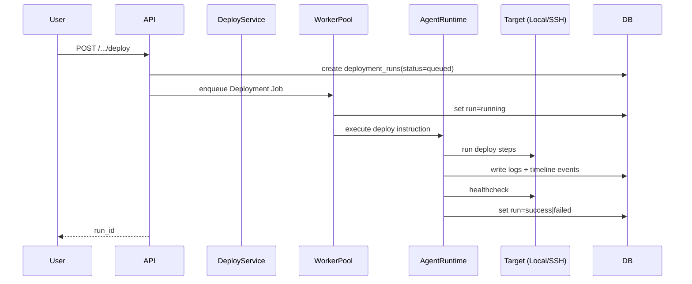
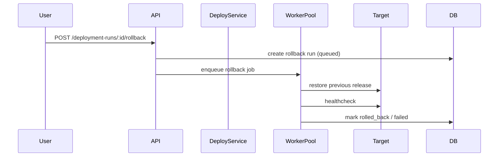

# SRS: Deployment Environments (Configurable Environments + Deploy Runs + Rollback)

## 1. Introduction
Tài liệu này mô tả đặc tả chi tiết cho tính năng quản lý deployment environments theo project, cho phép user tự định nghĩa nhiều môi trường (không hard-code `develop/staging`), trigger deploy bằng AI agent, theo dõi logs/timeline và rollback.

Mục tiêu chính:
- Mỗi project có thể cấu hình nhiều môi trường deploy với tên tùy ý.
- Mỗi môi trường có thể deploy vào `local` hoặc `ssh_remote`.
- Deploy run phải vận hành như một execution pipeline có trạng thái rõ ràng, logs real-time, timeline, retry/cancel/rollback.

## 2. Scope
### In-scope
- CRUD deployment environments theo project.
- Trigger deploy cho từng environment.
- Deploy run history + run details + logs/timeline.
- Rollback theo release trước đó.
- Domain mapping (optional) khi deploy thành công.
- RBAC, audit log, secret encryption.

### Out-of-scope (phase đầu)
- Preview theo commit/MR (đã có flow riêng).
- Multi-cloud abstraction đầy đủ (K8s/ECS/ArgoCD orchestration nâng cao).
- Auto DNS cho tất cả provider (phase đầu ưu tiên `manual` + `cloudflare` optional).

## 3. User Personas
- **Owner/Admin**: Tạo/sửa/xóa environment, trigger deploy, rollback, quản lý secret.
- **Developer**: Trigger deploy theo quyền project, xem logs/timeline/run history.
- **QA**: Theo dõi trạng thái deploy và chạy verify ở môi trường đích.

## 4. Navigation & UI Placement
### 4.1 Project Detail
Route nền: `/projects/:id`

Thêm 2 khu vực:
1. **Settings > Deployment Environments**
- Quản lý danh sách environments.
- Form config target local/remote, domain mapping, health check.
- Action `Test Connection` và `Test Domain Config`.

2. **Deployments (tab riêng trong Project Detail)**
- Danh sách deploy runs theo environment.
- Run detail drawer/page: steps, logs, timeline, output.
- Action `Start Deploy`, `Cancel`, `Retry`, `Rollback`.

## 5. Functional Requirements

### [SRS-DEP-001] List Environments
- **Trigger**: Vào `Settings > Deployment Environments`.
- **Input**: `project_id`.
- **Output**: Bảng environments theo project.
- **System Logic**: `GET /api/v1/projects/:id/deployment-environments`.

### [SRS-DEP-002] Create Environment (Custom Name)
- **Trigger**: Click `Add Environment`.
- **Input**:
  - `name` (ví dụ: `qa`, `uat`, `staging-eu`, `demo-customer-a`)
  - `target_type` (`local` | `ssh_remote`)
  - deploy/runtime params
  - optional domain mapping
- **Output**: Environment mới xuất hiện trong list.
- **Validation**:
  - name unique trong project.
  - slug chỉ gồm `[a-z0-9-]`.

### [SRS-DEP-003] Update Environment
- **Trigger**: Edit environment.
- **Input**: Partial/full config update.
- **Output**: Config cập nhật.
- **System Logic**: `PUT/PATCH /api/v1/projects/:id/deployment-environments/:env_id`.

### [SRS-DEP-004] Test Connection
- **Trigger**: Click `Test Connection`.
- **Input**: env config hiện tại.
- **Output**: pass/fail + diagnostics.
- **System Logic**: `POST /api/v1/projects/:id/deployment-environments/:env_id/test-connection`.

### [SRS-DEP-005] Start Deploy Run
- **Trigger**: Click `Start Deploy` tại environment card hoặc Deployments tab.
- **Input**:
  - `environment_id`
  - source deploy (branch/commit/build artifact)
  - optional release note
- **Output**: tạo run mới trạng thái `queued`.
- **System Logic**:
  - Tạo `deployment_run`.
  - Enqueue vào worker pool (`JobKind::Deployment`).
  - AI agent thực thi theo instruction template + config environment.

### [SRS-DEP-006] Real-time Logs & Timeline
- **Trigger**: mở run detail.
- **Output**:
  - Log stream real-time (agent/system).
  - Timeline theo step: precheck -> deploy -> healthcheck -> finalize.
- **System Logic**:
  - `GET /api/v1/deployment-runs/:run_id/logs`
  - `GET /api/v1/deployment-runs/:run_id/timeline`
  - optional SSE/WS stream endpoint.

### [SRS-DEP-007] Cancel/Retry Run
- **Trigger**: click `Cancel` hoặc `Retry`.
- **Validation**:
  - chỉ cancel khi `queued|running`.
  - retry theo policy (max retries, backoff).
- **System Logic**:
  - `POST /api/v1/deployment-runs/:run_id/cancel`
  - `POST /api/v1/deployment-runs/:run_id/retry`

### [SRS-DEP-008] Rollback
- **Trigger**: click `Rollback` trên run/release cũ.
- **Input**: `target_release_id` hoặc `target_run_id`.
- **Output**: rollback run mới.
- **System Logic**: `POST /api/v1/deployment-runs/:run_id/rollback`.

### [SRS-DEP-009] Domain Mapping
- **Trigger**: environment có domain config + deploy success.
- **Input**:
  - `primary_domain`
  - optional alias domains
  - `proxy_provider` (`nginx|caddy|traefik`)
  - `ssl_mode` (`off|manual|letsencrypt`)
- **Output**: domain hoạt động hoặc warning chi tiết.
- **System Logic**:
  - Apply proxy config trên target host.
  - Reload service an toàn.
  - Chạy HTTP healthcheck domain.

### [SRS-DEP-010] Auditability
- **Trigger**: mọi action setup/deploy/rollback.
- **Output**: audit trail đầy đủ actor, input, result, timestamp.

## 6. Data Model (Proposed)

### 6.1 deployment_environments
- `id` UUID PK
- `project_id` UUID FK
- `name` TEXT (user visible, unique per project)
- `slug` TEXT (normalized)
- `description` TEXT NULL
- `target_type` ENUM(`local`,`ssh_remote`)
- `is_enabled` BOOL default true
- `is_default` BOOL default false
- `runtime_type` ENUM(`compose`,`systemd`,`raw_script`) default `raw_script`
- `deploy_path` TEXT
- `artifact_strategy` ENUM(`git_pull`,`upload_bundle`,`build_artifact`) default `build_artifact`
- `branch_policy` JSONB (allowlist/pattern)
- `healthcheck_url` TEXT NULL
- `healthcheck_timeout_secs` INT default 60
- `healthcheck_expected_status` INT default 200
- `domain_config` JSONB NULL
- `created_by`, `created_at`, `updated_at`

Constraints:
- unique `(project_id, lower(name))`
- unique `(project_id, is_default)` where `is_default=true`

### 6.2 deployment_environment_secrets
- `id` UUID PK
- `environment_id` UUID FK
- `secret_type` ENUM(`ssh_private_key`,`ssh_password`,`api_token`,`known_hosts`,`env_file`)
- `ciphertext` TEXT (AES-GCM encrypted)
- `created_at`, `updated_at`

### 6.3 deployment_runs
- `id` UUID PK
- `project_id` UUID FK
- `environment_id` UUID FK
- `status` ENUM(`queued`,`running`,`success`,`failed`,`cancelled`,`rolling_back`,`rolled_back`)
- `trigger_type` ENUM(`manual`,`auto`,`rollback`,`retry`)
- `triggered_by` UUID FK NULL
- `source_type` ENUM(`branch`,`commit`,`artifact`,`release`)
- `source_ref` TEXT
- `attempt_id` UUID NULL (nếu run khởi phát từ task attempt)
- `started_at`, `completed_at`
- `error_message` TEXT NULL
- `metadata` JSONB

Constraints:
- partial unique index: tối đa 1 run active (`queued|running|rolling_back`) cho mỗi environment.

### 6.4 deployment_releases
- `id` UUID PK
- `project_id` UUID FK
- `environment_id` UUID FK
- `run_id` UUID FK
- `version_label` TEXT
- `artifact_ref` TEXT NULL
- `git_commit_sha` TEXT NULL
- `status` ENUM(`active`,`superseded`,`failed`,`rolled_back`)
- `deployed_at` TIMESTAMP
- `metadata` JSONB

### 6.5 deployment_timeline_events
- `id` UUID PK
- `run_id` UUID FK
- `step` ENUM(`precheck`,`connect`,`prepare`,`deploy`,`domain_config`,`healthcheck`,`finalize`,`rollback`)
- `event_type` ENUM(`system`,`agent`,`command`,`warning`,`error`)
- `message` TEXT
- `payload` JSONB
- `created_at`

## 7. API Contract (Proposed)

### 7.1 Environment APIs
1. `GET /api/v1/projects/:id/deployment-environments`
2. `POST /api/v1/projects/:id/deployment-environments`
3. `GET /api/v1/projects/:id/deployment-environments/:env_id`
4. `PUT /api/v1/projects/:id/deployment-environments/:env_id`
5. `PATCH /api/v1/projects/:id/deployment-environments/:env_id`
6. `DELETE /api/v1/projects/:id/deployment-environments/:env_id`
7. `POST /api/v1/projects/:id/deployment-environments/:env_id/test-connection`
8. `POST /api/v1/projects/:id/deployment-environments/:env_id/test-domain`

### 7.2 Deploy Run APIs
1. `POST /api/v1/projects/:id/deployment-environments/:env_id/deploy`
2. `GET /api/v1/projects/:id/deployment-runs`
3. `GET /api/v1/deployment-runs/:run_id`
4. `GET /api/v1/deployment-runs/:run_id/logs`
5. `GET /api/v1/deployment-runs/:run_id/timeline`
6. `GET /api/v1/deployment-runs/:run_id/stream` (SSE/WS)
7. `POST /api/v1/deployment-runs/:run_id/cancel`
8. `POST /api/v1/deployment-runs/:run_id/retry`
9. `POST /api/v1/deployment-runs/:run_id/rollback`

### 7.3 Release APIs
1. `GET /api/v1/projects/:id/deployment-environments/:env_id/releases`
2. `GET /api/v1/deployment-releases/:release_id`

## 8. Runtime Flow

### 8.1 Start Deploy (task-like run with agent logs)

### 8.2 Rollback

## 9. AI Agent Integration Rules
- Deploy run được xử lý bởi agent runtime, nhưng trong guardrails cố định.
- Instruction template phải gồm:
  - target info (sanitized)
  - source ref
  - deploy policy
  - rollback policy
  - output contract (structured log keys)
- Không cho phép user nhập command tùy ý full quyền.
- Chỉ cho phép command qua template/whitelist theo `runtime_type`.

Structured keys đề xuất từ agent output:
- `deploy_step`
- `deploy_status`
- `deploy_error`
- `release_version`
- `healthcheck_status`
- `healthcheck_url`
- `rollback_recommended`

## 10. Security & Compliance
- Secret SSH/domain token phải lưu encrypted bằng `EncryptionService`.
- Không log plaintext secret vào `agent_logs` hoặc `timeline`.
- Remote deploy mặc định deny `root` login.
- Bắt buộc verify host key (known_hosts) khi SSH.
- RBAC:
  - Setup environment: `ManageProject`
  - Trigger deploy/rollback: `ExecuteTask` hoặc `ManageProject` (chốt policy ở phase implementation)
  - View logs/history: `ViewProject`

## 11. Observability
- Metrics:
  - `deployment_runs_total{status,env}`
  - `deployment_run_duration_seconds{env}`
  - `deployment_failures_total{step}`
  - `rollback_runs_total{result}`
- Alerts:
  - consecutive failures theo environment
  - healthcheck fail sau deploy success

## 12. UX Requirements
### 12.1 Deployment Settings (Project-level)
- Environment list table (name, target type, domain, status, last deploy).
- `Add Environment` modal:
  - Basic info
  - Target config
  - Domain config
  - Connection test
- Secret fields masked + update separately.

### 12.2 Deployments Tab
- Filter theo environment, status, triggered_by, time range.
- Run detail panel:
  - step timeline
  - live logs
  - metadata/output
  - actions: cancel/retry/rollback

## 13. Backward Compatibility
- Không phá flow deploy hiện tại (`POST /projects/:id/deploy`) ở phase migration.
- Phase 1 có thể map endpoint cũ sang default environment nếu đã cấu hình.
- Nếu project chưa có environment mới, endpoint cũ hoạt động như trước.

## 14. Rollout Plan
### Phase 1
- DB migration cho environments + runs + timeline.
- CRUD + test connection APIs.
- UI settings cho environment management.

### Phase 2
- Deploy run engine cho `local` target.
- Logs/timeline realtime.

### Phase 3
- SSH remote target + secret encryption + host verification.

### Phase 4
- Domain mapping + proxy config + SSL modes.

### Phase 5
- Rollback + release management + hardening.

## 15. Acceptance Criteria (MVP)
1. User tạo được nhiều environment tùy ý theo project.
2. Mỗi environment deploy được qua `local` hoặc `ssh_remote` (ít nhất local trong MVP sớm).
3. Start deploy tạo run trạng thái rõ ràng và có logs/timeline.
4. Có lịch sử deploy theo environment.
5. Có rollback action tạo rollback run mới.
6. Secret được encrypt at-rest.

## 16. Test Plan
### Unit Tests
- Config validation (name uniqueness, target validation, domain schema).
- State transition `deployment_runs`.
- Rollback selection logic.

### Integration Tests
- Environment CRUD + permission checks.
- Start deploy flow + run status updates.
- Cancel/retry/rollback API flows.
- SSH connection test (mock target).

### E2E Tests
- User tạo environment -> start deploy -> xem logs -> rollback.

## 17. Open Questions
1. Policy quyền trigger deploy: `ExecuteTask` hay `ManageProject`?
2. Có cần tách agent provider riêng cho deploy run hay dùng global provider?
3. Multi-domain routing per environment có cần wildcard certificate automation ở phase đầu không?
4. Có cho phép rollback cross-environment không (khuyến nghị: không)?

## 18. Related Planning Docs
- Backlog triển khai chi tiết: [deployment-environments-backlog.md](deployment-environments-backlog.md)
- Luồng kỹ thuật E2E: [../feature-flows/environment-deployment.md](../feature-flows/environment-deployment.md)
