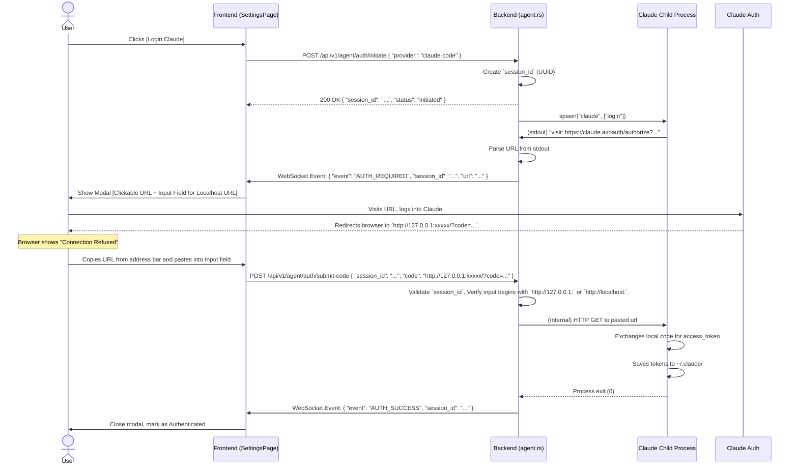

# Claude OAuth Flow Integration

Tracking checklist: [UI Agent Authentication - Ticket Breakdown Checklist](./auth-ui-ticket-breakdown-checklist.md)

## 0. Current Implementation Snapshot (2026-02-27)

- Initiate command: `claude auth login`
- Parsed artifacts from CLI output:
  - authorization URL (`action_url`)
  - loopback callback port when URL points to localhost
- Callback submit behavior:
  - localhost callback URL is accepted only for `127.0.0.1` or `localhost`
  - if session has `allowed_loopback_port`, callback port must match
  - callback request is proxied server-side with redirects disabled
  - non-localhost HTTP/HTTPS URLs are rejected
- UI path:
  - auth modal shows URL/hint and allows callback URL paste
  - status updates streamed over `/api/v1/agent/auth/sessions/:id/ws`

## 1. Context and Flow Type
The Anthropic Claude Code CLI (`claude login`) uses a standard **Web Server OAuth Flow with PKCE**, which redirects the user's browser back to a **local loopback server** spun up by the CLI (e.g., `http://127.0.0.1:xxx/?code=...`).

### The Headless Server Challenge
Because the Web UI runs in the user's local browser, but the CLI runs on a remote headless server:
- The redirect to `127.0.0.1` will fail. 
- **Anti-Pattern:** We DO NOT ask the user to set up SSH port-forwarding. This is brittle, complex, and unscalable.
- **Solution:** We implement the **Loopback Proxy Pattern**. We instruct the user to copy the failed `http://127.0.0.1:xxx/?code=...` URL from their browser's address bar and paste it into the Web UI. The Rust backend then executes an internal `GET` request against the local loopback server spun up by the Claude CLI.

## 2. Technical Sequence Diagram



## 3. Implementation Details

### 3.1 Backend Handling (Rust)
The implementation requires mapping the `session_id` and securely handling the loopback proxy request without exposing an SSRF (Server-Side Request Forgery) vulnerability.

```rust
async fn submit_auth_code(State(state): State<AppState>, Json(req): Json<SubmitCodeReq>) {
    // 1. Session verification
    let _session = state.auth_sessions.get(&req.session_id).ok_or("Invalid session")?;
    
    // 2. Input sanitization (Prevent SSRF)
    let url = req.code.trim();
    if !url.starts_with("http://127.0.0.1:") && !url.starts_with("http://localhost:") {
         return Err("Invalid URL callback");
    }

    // 3. Loopback Proxy Call
    let client = reqwest::Client::new();
    let res = client.get(url).send().await?;
    // The CLI should automatically exit 0 upon receiving this GET request
}
```

### 3.2 Frontend UI State
1. Catch the `AUTH_REQUIRED` event for Claude.
2. Display the UI instruction:
   > **1. Click the link below to authorize Claude.** 
   > **2. Your browser will eventually fail to load a localhost page.**
   > **3. Copy the URL from your browser's address bar and paste it below.**
3. Render an input box for the user to submit back to `submit-code`.

## 4. Security & Redaction
- **Log Masking:** Do not log the raw URL pasted by the user. The parameter `?code=xxxx` is highly sensitive (it's the OAuth authorization code).
- **SSRF Prevention:** The Rust backend MUST strictly enforce that the URL begins natively with `127.0.0.1` or `localhost` and belongs to the port range opened by the CLI. Requests to `169.254.169.254` or internal subnets must be explicitly dropped.
