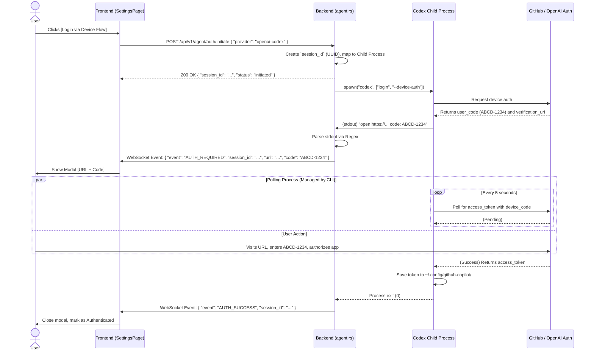

# Codex Device-Auth Flow Integration

Tracking checklist: [UI Agent Authentication - Ticket Breakdown Checklist](./auth-ui-ticket-breakdown-checklist.md)

## 0. Current Implementation Snapshot (2026-02-27)

- Initiate command: `codex login --device-auth`
- Parsed artifacts from CLI output:
  - device verification URL (`action_url`)
  - device code (`action_code`)
- UI path:
  - user clicks `Sign in` or `Re-auth`
  - backend creates auth session
  - frontend listens via `/api/v1/agent/auth/sessions/:id/ws`
  - modal shows URL/code and session status transitions
- Submit path:
  - device code can be submitted through `POST /api/v1/agent/auth/submit-code`
  - input is piped to CLI stdin for non-callback values
- Terminal mapping:
  - process exit code `0` -> `succeeded`
  - non-zero/wait errors -> `failed`
  - timeout watchdog -> `timed_out`

## 1. Context and Flow Type
The OpenAI Codex CLI (and GitHub Copilot CLI) uses the **OAuth 2.0 Device Authorization Grant (Device Flow)**. 
In this flow, the user does not need to copy and paste a token back into the terminal. Instead:
1. The CLI requests an authorization code from the identity provider.
2. The CLI displays a URL (`verification_uri`) and a short code (`user_code`) to the user.
3. The user visits the URL on any device and enters the code.
4. Concurrently, the CLI polls the identity provider using the `device_code` to check if the user has completed the authorization.
5. Once authorized, the identity provider returns an `access_token` to the CLI, which saves it and exits cleanly.

### Expected CLI Output
When spawning `codex login --device-auth`, the `stdout` will generally output:
```text
First, copy your one-time code: ABCD-1234
Next, open https://github.com/login/device in your browser.
Waiting for authentication...
```

## 2. Technical Sequence Diagram



## 3. Implementation Details

### 3.1 Backend Handling (Rust)
The backend spawns the CLI, binds it to the `session_id`, and reads its stdout asynchronously:

```rust
let mut child = Command::new("codex")
    .args(["login", "--device-auth"])
    .stdout(Stdio::piped())
    .spawn()?;

let stdout = child.stdout.take().unwrap();
let mut reader = BufReader::new(stdout).lines();

while let Some(line) = reader.next_line().await? {
    if let Some((url, code)) = parse_device_flow_output(&line) {
        broadcast_auth_event(AuthEvent::DeviceFlow { session_id, url, user_code: code }).await;
    }
}

// Wait for the child to exit
let status = child.wait().await?;
if status.success() {
    broadcast_auth_event(AuthEvent::Success { session_id }).await;
} else {
    broadcast_auth_event(AuthEvent::Failed { session_id }).await;
}
```

### 3.2 Regex Parsing Heuristics
Because Codex CLI might change its exact output formatting, the parser should use flexible regexes:
- **URL Regex:** `https:\/\/[a-zA-Z0-9.\/-]+/device`
- **Code Regex:** `[A-Z0-9]{4}-[A-Z0-9]{4}` (Typical 8-character device code)

### 3.3 Frontend UI State
When the `AUTH_REQUIRED` WebSocket event comes in with the `user_code`, the React frontend will display:
- A large, selectable text block containing the `user_code` with a quick "Copy" button.
- A button linking `target="_blank"` to the `verification_uri`.
- A spinning loader indicating "Waiting for authorization from provider...".

## 4. Security & Timeout Policies
- **Redaction:** The `user_code` (e.g. `ABCD-1234`) is a short-lived credential. It shouldn't be printed in the global backend log in plain text. Use `ABCD-****` for debugging logs. 
- **Timeouts:** The child process should be killed (`child.kill()`) if the polling process exceeds 5 minutes without completion, ensuring no zombie Codex processes remain on the server.
- **Session Constraint:** Only WebSocket clients subscribed to the particular `session_id` should receive the auth events.
