# Gemini Auth Integration Strategy

Tracking checklist: [UI Agent Authentication - Ticket Breakdown Checklist](./auth-ui-ticket-breakdown-checklist.md)

## 0. Current Implementation Snapshot (2026-02-27)

- Initiate command: `gemini auth`
- Parsed artifacts from CLI output:
  - auth URL (`action_url`) when present
  - OOB code (`action_code`) when present
  - loopback port extraction for localhost callback URLs
- Submit path:
  - raw code is piped to CLI stdin
  - localhost callback URL is proxied server-side with strict host/port checks
  - non-localhost callback URL is rejected
- Availability check strategy:
  - CLI installed: `gemini --version`
  - auth probe: `gemini -p "ping"` (timeout protected)
  - mapped to `available` / `not_available` via provider status contract

## 1. Context and Flow Type
The Google Gemini CLI (and `gcloud`) often uses an **Out-Of-Band (OOB) OAuth Flow** or a **Local Loopback OAuth Flow**.
Because Google has heavily deprecated traditional OOB copy-paste flows for many OAuth apps, the implementation must be robust enough to handle whichever flow the underlying CLI invokes.

1. **If the CLI outputs OOB:** Standard terminal interaction ("Enter the authorization code: ").
2. **If the CLI outputs a Loopback Local Server URL:** The user is redirected to localhost. Since the UI runs on the user's browser, and the CLI runs on a headless remote server, the user's browser will fail to connect. We use the **Loopback Proxy Pattern**: we ask the user to copy the `http://127.0.0.1:xxx/?code=...` URL from their browser's address bar and paste it into the Web UI. The backend then makes that request locally against the CLI.

## 2. Technical Sequence Diagram (Unified OOB/Proxy Flow)

```mermaid
sequenceDiagram
    actor User
    participant WebUI as Frontend (SettingsPage)
    participant API as Backend (agent.rs)
    participant CLI as Gemini Child Process
    participant IDP as Google Auth

    User->>WebUI: Clicks [Login Gemini]
    WebUI->>API: POST /api/v1/agent/auth/initiate { "provider": "gemini-cli" }
    API->>API: Create `session_id` (UUID), map to Child Process
    API-->>WebUI: 200 OK { "session_id": "...", "status": "initiated" }
    API->>CLI: spawn("gemini", ["auth"]) with piped stdin/stdout
    
    CLI->>API: (stdout) "visit URL... \n Enter code: "
    API->>API: Parse URL from stdout via Regex (Mask sensitive query params in logs)
    API->>WebUI: WebSocket Event: { "event": "AUTH_REQUIRED", "session_id": "...", "url": "..." }
    
    WebUI->>User: Show Modal [Clickable URL + Input Field for Code or Localhost URL]
    User->>IDP: Visits URL, logs into Google
    
    alt OOB Copy-Paste 
        IDP-->>User: Displays authorization code on screen (4/0AeaY...)
        User->>WebUI: Pastes Code (4/0AeaY...) into Input
    else Local Loopback Deprecation
        IDP-->>User: Browser redirects to `http://localhost:12345/?code=...`
        Note over User: Browser shows "Connection Refused"
        User->>WebUI: Copies `http://localhost:12345/?code...` into Input
    end
    
    WebUI->>API: POST /api/v1/agent/auth/submit-code { "session_id": "...", "code": "<Pasted Value>" }
    API->>API: Verify `session_id` belongs to active process.
    
    alt If Pasted Value is localhost URL
        API->>CLI: (Internal) HTTP GET to pasted localhost URL
    else If Pasted Value is raw Code
        API->>CLI: stdin.write(code + "\n")
    end
    
    API-->>WebUI: 200 OK
    CLI->>CLI: Saves tokens to ~/.gemini/
    CLI-->>API: Process exit (0)
    
    API->>WebUI: WebSocket Event: { "event": "AUTH_SUCCESS", "session_id": "..." }
    WebUI->>User: Close modal, mark as Authenticated
```

## 3. Security Considerations
- **Session Identification:** All API calls and WebSocket payloads require the `session_id` payload.
- **Redaction:** WebSockets must send the URL, but Backend logging prints the URL as: `https://accounts.google.com/o/oauth2/...<MASKED_PARAMS>`. The raw OOB code or sensitive Localhost Query Parameters MUST NOT be echoed back into the global `backend.log`.
- **Brittle Deprecation:** Because OOB is deprecated, the UI modal instructions MUST specify: *"If your browser fails to load a `localhost` page, copy the entire URL from the address bar and paste it below."*
